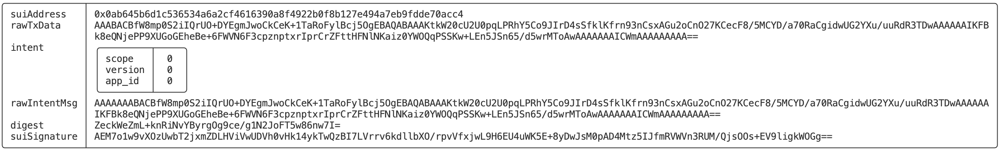
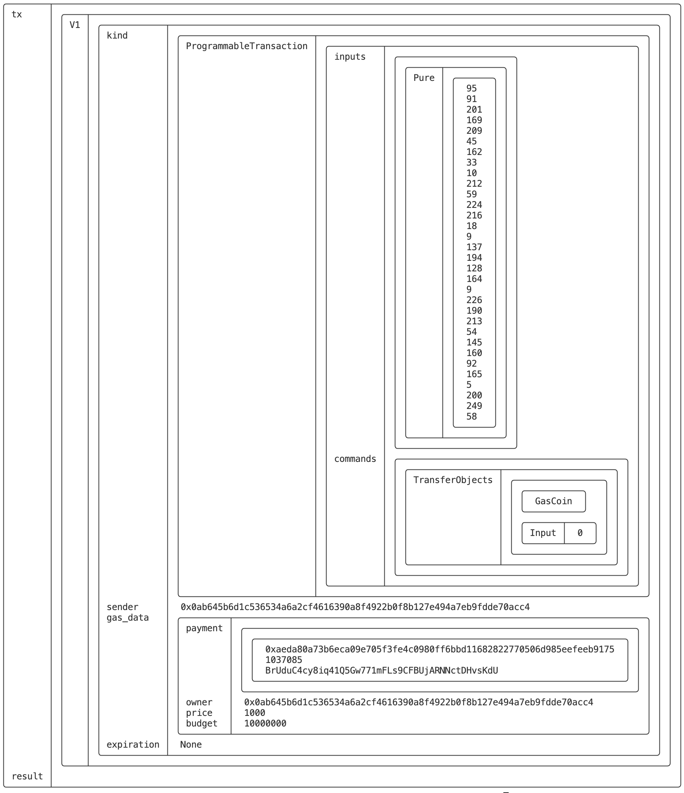
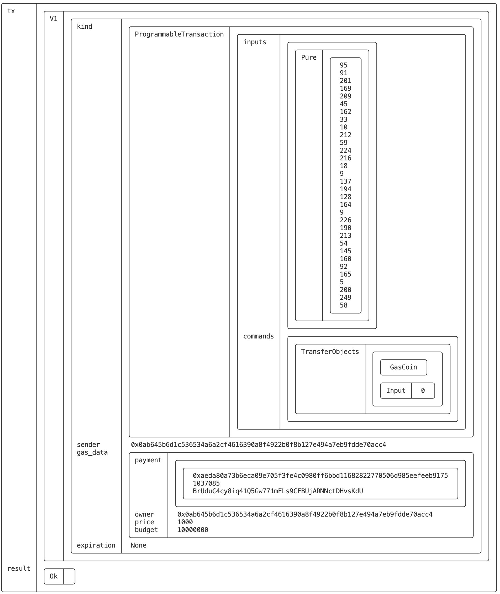
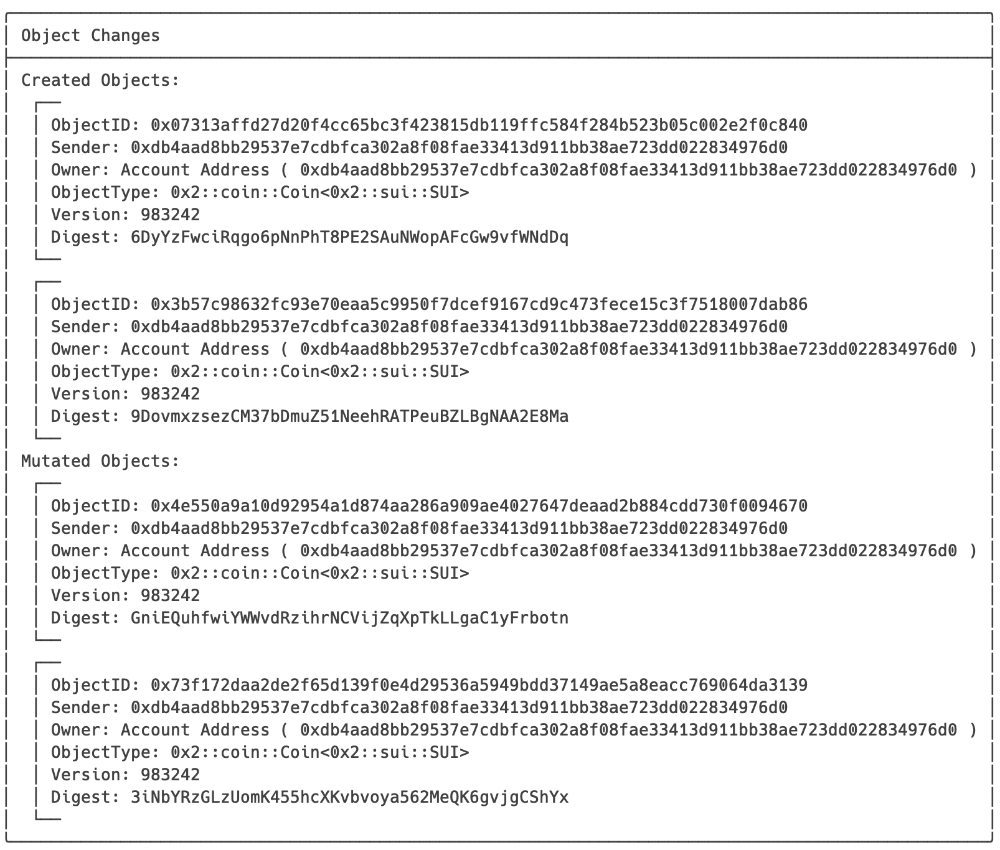
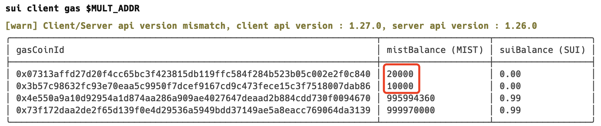
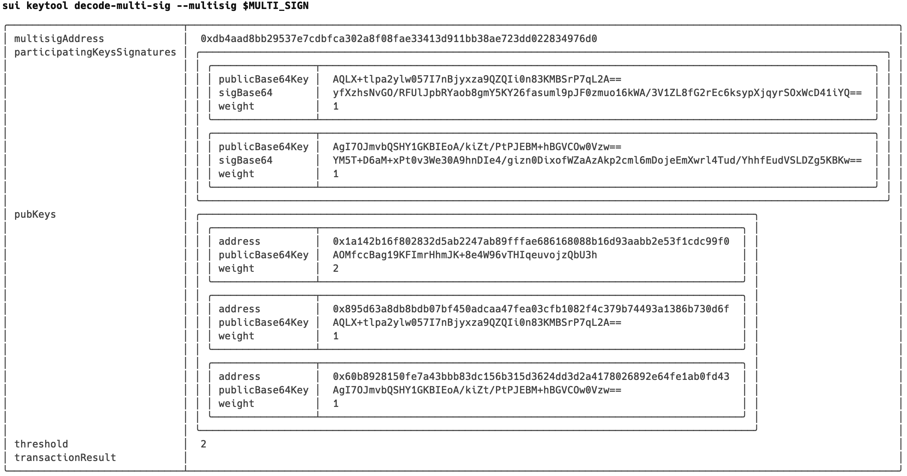
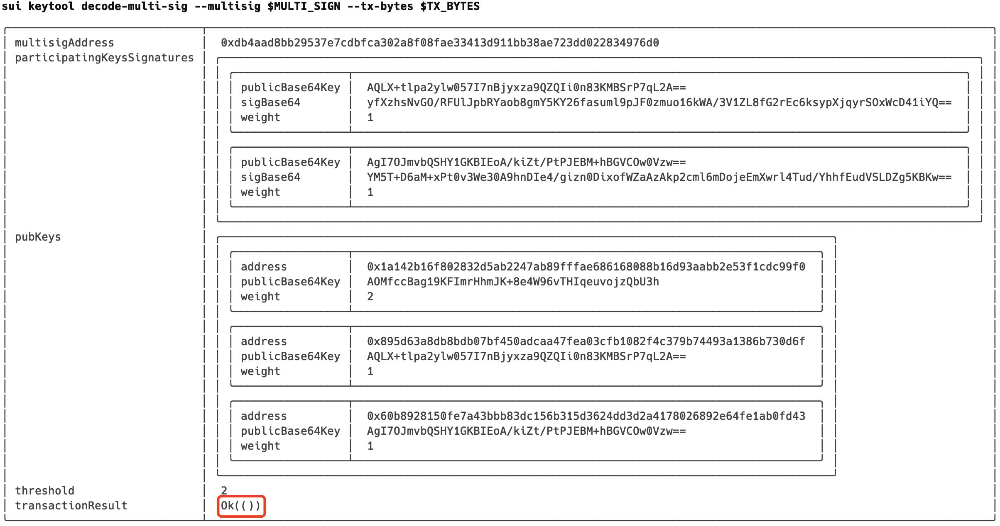
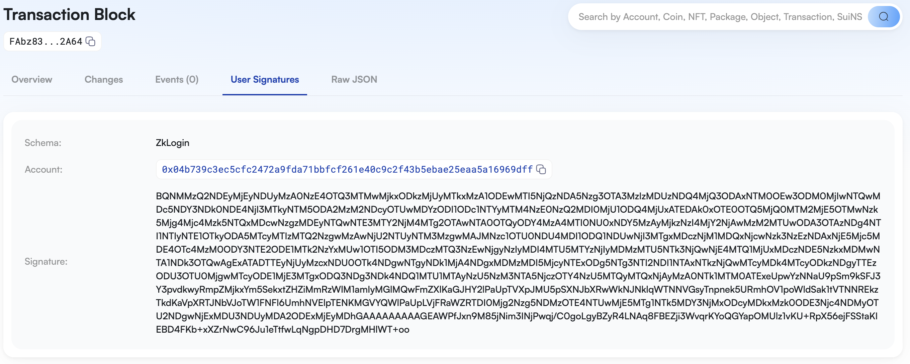
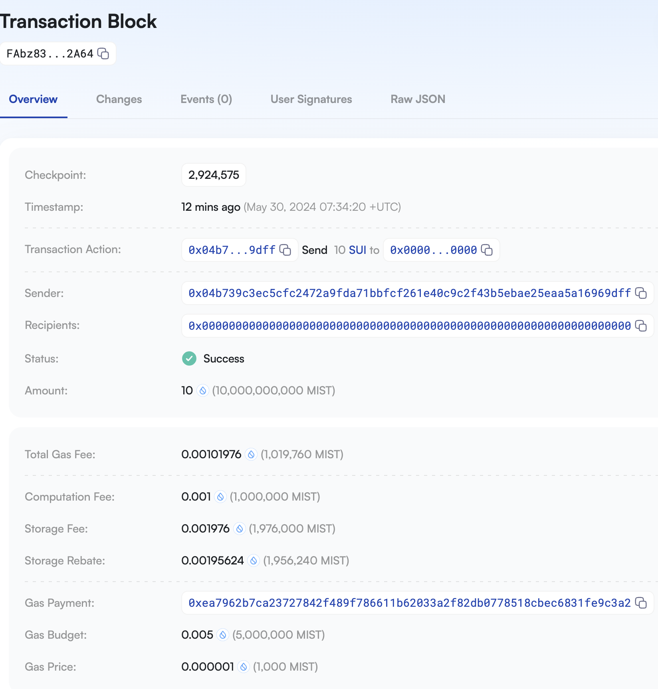

# Keytool

## 1 命令说明

`sui keytool`的子命令集主要是涉及私钥相关的命令行工具，包括私钥创建、签名验签、单签多签及`zkLogin`相关命令等。

可通过`help/-h`获取完整的子命令：

```bash
Sui keystore tool

Usage: sui keytool [OPTIONS] <COMMAND>

Commands:
  update-alias                             Update an old alias to a new one. If a new alias is not provided, a random one
                                               will be generated
  convert                                  Convert private key in Hex or Base64 to new format (Bech32 encoded 33 byte flag
                                               || private key starting with "suiprivkey"). Hex private key format import and
                                               export are both deprecated in Sui Wallet and Sui CLI Keystore. Use `sui keytool
                                               import` if you wish to import a key to Sui Keystore
  decode-or-verify-tx                      Given a Base64 encoded transaction bytes, decode its components. If a signature
                                               is provided, verify the signature against the transaction and output the result
  decode-multi-sig                         Given a Base64 encoded MultiSig signature, decode its components. If tx_bytes is
                                               passed in, verify the multisig
  generate                                 Generate a new keypair with key scheme flag {ed25519 | secp256k1 | secp256r1}
                                               with optional derivation path, default to m/44'/784'/0'/0'/0' for ed25519 or
                                               m/54'/784'/0'/0/0 for secp256k1 or m/74'/784'/0'/0/0 for secp256r1. Word length
                                               can be { word12 | word15 | word18 | word21 | word24} default to word12 if not
                                               specified
  import                                   Add a new key to Sui CLI Keystore using either the input mnemonic phrase or a
                                               Bech32 encoded 33-byte `flag || privkey` starting with "suiprivkey", the key
                                               scheme flag {ed25519 | secp256k1 | secp256r1} and an optional derivation path,
                                               default to m/44'/784'/0'/0'/0' for ed25519 or m/54'/784'/0'/0/0 for secp256k1 or
                                               m/74'/784'/0'/0/0 for secp256r1. Supports mnemonic phrase of word length 12, 15,
                                               18, 21, 24. Set an alias for the key with the --alias flag. If no alias is
                                               provided, the tool will automatically generate one
  export                                   Output the private key of the given key identity in Sui CLI Keystore as Bech32
                                               encoded string starting with `suiprivkey`
  list                                     List all keys by its Sui address, Base64 encoded public key, key scheme name in
                                               sui.keystore
  load-keypair                             This reads the content at the provided file path. The accepted format can be
                                               [enum SuiKeyPair] (Base64 encoded of 33-byte `flag || privkey`) or `type
                                               AuthorityKeyPair` (Base64 encoded `privkey`). This prints out the account keypair
                                               as Base64 encoded `flag || privkey`, the network keypair, worker keypair,
                                               protocol keypair as Base64 encoded `privkey`
  multi-sig-address                        To MultiSig Sui Address. Pass in a list of all public keys `flag || pk` in
                                               Base64. See `keytool list` for example public keys
  multi-sig-combine-partial-sig            Provides a list of participating signatures (`flag || sig || pk` encoded in
                                               Base64), threshold, a list of all public keys and a list of their weights that
                                               define the MultiSig address. Returns a valid MultiSig signature and its sender
                                               address. The result can be used as signature field for `sui client
                                               execute-signed-tx`. The sum of weights of all signatures must be >= the threshold
  multi-sig-combine-partial-sig-legacy     
  show                                     Read the content at the provided file path. The accepted format can be [enum
                                               SuiKeyPair] (Base64 encoded of 33-byte `flag || privkey`) or `type
                                               AuthorityKeyPair` (Base64 encoded `privkey`). It prints its Base64 encoded public
                                               key and the key scheme flag
  sign                                     Create signature using the private key for for the given address (or its alias)
                                               in sui keystore. Any signature commits to a [struct IntentMessage] consisting of
                                               the Base64 encoded of the BCS serialized transaction bytes itself and its intent.
                                               If intent is absent, default will be used
  sign-kms                                 Creates a signature by leveraging AWS KMS. Pass in a key-id to leverage Amazon
                                               KMS to sign a message and the base64 pubkey. Generate PubKey from pem using
                                               MystenLabs/base64pemkey Any signature commits to a [struct IntentMessage]
                                               consisting of the Base64 encoded of the BCS serialized transaction bytes itself
                                               and its intent. If intent is absent, default will be used
  unpack                                   This takes [enum SuiKeyPair] of Base64 encoded of 33-byte `flag || privkey`). It
                                               outputs the keypair into a file at the current directory where the address is the
                                               filename, and prints out its Sui address, Base64 encoded public key, the key
                                               scheme, and the key scheme flag
  zk-login-sign-and-execute-tx             Given the max_epoch, generate an OAuth url, ask user to paste the redirect with
                                               id_token, call salt server, then call the prover server, create a test
                                               transaction, use the ephemeral key to sign and execute it by assembling to a
                                               serialized zkLogin signature
  zk-login-enter-token                     A workaround to the above command because sometimes token pasting does not work
                                               (for Facebook). All the inputs required here are printed from the command above
  zk-login-sig-verify                      Given a zkLogin signature, parse it if valid. If `bytes` provided, parse it as
                                               either as TransactionData or PersonalMessage based on `intent_scope`. It verifies
                                               the zkLogin signature based its latest JWK fetched. Example request: sui keytool
                                               zk-login-sig-verify --sig $SERIALIZED_ZKLOGIN_SIG --bytes $BYTES --intent-scope 0
                                               --network devnet --curr-epoch 10
  zk-login-insecure-sign-personal-message  TESTING ONLY: Generate a fixed ephemeral key and its JWT token with test issuer.
                                               Produce a zklogin signature for the given data and max epoch. e.g. sui keytool
                                               zk-login-insecure-sign-personal-message --data "hello" --max-epoch 5
```

## 2 命令分类

根据命令实现功能分为以下几类：

### 2.1 密钥对类

| 子命令  | 功能说明 |
| ------ | ------ |
| [**`generate`**](#311-generate生成密钥对) | 生成密钥对 |
| [**`show`**](#312-show查看密钥) | 查看密钥 |
| [**`unpack`**](#313-unpack解码密钥) | 解码密钥 |
| [**`convert`**](#314-convert密钥格式转换) | 密钥格式转换 |
| [**`import`**](#315-import导入私钥到sui-cli-keystore) | 导入私钥到`Sui CLI Keystore` |
| [**`export`**](#316-export导出私钥) | 导出私钥 |
| [**`list`**](#317-list列出本地keystore所有私钥对应的地址及公钥等信息) | 列出本地`Keystore`所有私钥对应的地址及公钥等信息 |
| [**`update-alias`**](#318-update-alias更新别名) | 更新别名 |
| [**`load-keypair`**](#319-load-keypair加载多种类型的密钥对) | 加载多种类型的密钥对 |

### 2.2 单签类

| 子命令  | 功能说明 |
| ------ | ------ |
| [**`sign`**](#321-sign交易签名) | 交易签名 |
| [**`decode-or-verify-tx`**](#322-decode-or-verify-tx交易解码或签名交易验签) | 交易解码或签名交易验签 |

### 2.3 多签类

| 子命令  | 功能说明 |
| ------ | ------ |
| [**`multi-sig-address`**](#331-multi-sig-address创建多重签名地址) | 创建多重签名地址 |
| [**`multi-sig-combine-partial-sig`**](#332-multi-sig-combine-partial-sig合并签名) | 合并签名 |
| [**`decode-multi-sig`**](#333-decode-multi-sig多签解码) | 多签解码 |

### 2.4 zkLogin类

| 子命令  | 功能说明 |
| ------ | ------ |
| [**`zk-login-sign-and-execute-tx `**](#341-zk-login-sign-and-execute-tx-zklogin登录验签执行接口) | zkLogin登录、验签、执行接口 |
| [**`zk-login-sig-verify `**](#342-zk-login-sig-verify-zklogin签名验证) | zkLogin签名验证 |

## 3 命令详解
### 3.1 链网络类

#### 3.1.1 `generate`：生成密钥对

##### (1) 命令说明
执行该命令可以生成新密钥对，用户可以指定密钥方案和派生路径，若不指定将使用默认值，默认助记词长度为12个单词

```
Generate a new keypair with key scheme flag {ed25519 | secp256k1 | secp256r1} with optional derivation path, default to m/44'/784'/0'/0'/0' for ed25519 or m/54'/784'/0'/0/0 for secp256k1 or m/74'/784'/0'/0/0 for secp256r1. Word length can be { word12 | word15 | word18 | word21 | word24} default to word12 if not specified

Usage: sui keytool generate [OPTIONS] <KEY_SCHEME> [DERIVATION_PATH] [WORD_LENGTH]

Arguments:
  <KEY_SCHEME>
  [DERIVATION_PATH]
  [WORD_LENGTH]
```

| KEY SCHEME  | DEFAULT DERIVATION PATH |
| ----------- | ----------------------- |
| `ed25519`   | `m/44'/784'/0'/0'/0'`   |
| `secp256k1` | `m/54'/784'/0'/0/0`     |
| `secp256r1` | `m/74'/784'/0'/0/0`     |

##### (2) 命令使用
-   **直接创建**

```bash
$ sui keytool generate ed25519
╭─────────────────┬────────────────────────────────────────────────────────────────────────────────────────────╮
│ alias           │                                                                                            │
│ suiAddress      │  0x0ab645b6d1c536534a6a2cf4616390a8f4922b0f8b127e494a7eb9fdde70acc4                        │
│ publicBase64Key │  AGwzSkAPgy3Pkgl+ZFVZWfdFQz9COw46z4RX2WKCRY4a                                              │
│ keyScheme       │  ed25519                                                                                   │
│ flag            │  0                                                                                         │
│ mnemonic        │  fetch mushroom celery actress capital clip update neutral kangaroo deal picture identify  │
│ peerId          │  6c334a400f832dcf92097e64555959f745433f423b0e3acf8457d96282458e1a                          │
╰─────────────────┴────────────────────────────────────────────────────────────────────────────────────────────╯

# 本地生成私钥文件
$ cat 0x0ab645b6d1c536534a6a2cf4616390a8f4922b0f8b127e494a7eb9fdde70acc4.key 
AEXleFEKuJrNh9E3kpvwLqdsfeQfuliUQQ61cvJVfq4N
```

-   **指定派生路径和助记词长度创建**

```bash
$ sui keytool generate secp256k1 "m/54'/784'/0'/0/0" word15
╭─────────────────┬────────────────────────────────────────────────────────────────────────────────────────────────────────╮
│ alias           │                                                                                                        │
│ suiAddress      │  0x5f5bc9a9d12da2210ad43be0d8120989c280a409e2bed53691a05ca505c8f93a                                    │
│ publicBase64Key │  AQNxN3EAZbPLFUNT9z8HgnaNlRumUvGSmawdr1igYMVCrg==                                                      │
│ keyScheme       │  secp256k1                                                                                             │
│ flag            │  1                                                                                                     │
│ mnemonic        │  over shaft village combine puzzle muscle fantasy relief early select acquire boy tourist hybrid fine  │
│ peerId          │                                                                                                        │
╰─────────────────┴────────────────────────────────────────────────────────────────────────────────────────────────────────╯

# 本地生成私钥文件
$ cat 0x5f5bc9a9d12da2210ad43be0d8120989c280a409e2bed53691a05ca505c8f93a.key 
Af+2Y9EdQuFUUePBcUfbJHduivR+cg794FrmrvBS1rXf
```

#### 3.1.2 `show`：查看密钥

##### （1）命令说明

执行该命令可以读取指定路径的私钥文件，并打印`Base64`编码公钥、密钥方案等信息。

```
Read the content at the provided file path. The accepted format can be [enum SuiKeyPair] (Base64 encoded of 33-byte `flag || privkey`) or `type AuthorityKeyPair` (Base64 encoded `privkey`). It prints its Base64 encoded public key and the key scheme flag

Usage: sui keytool show [OPTIONS] <FILE>

Arguments:
  <FILE>
```

##### （2）命令使用

>   输出内容跟`generate`生成的一致。

```bash
$ sui keytool show ./0x0ab645b6d1c536534a6a2cf4616390a8f4922b0f8b127e494a7eb9fdde70acc4.key
╭─────────────────┬──────────────────────────────────────────────────────────────────────╮
│ alias           │                                                                      │
│ suiAddress      │  0x0ab645b6d1c536534a6a2cf4616390a8f4922b0f8b127e494a7eb9fdde70acc4  │
│ publicBase64Key │  AGwzSkAPgy3Pkgl+ZFVZWfdFQz9COw46z4RX2WKCRY4a                        │
│ keyScheme       │  ed25519                                                             │
│ flag            │  0                                                                   │
│ peerId          │  6c334a400f832dcf92097e64555959f745433f423b0e3acf8457d96282458e1a    │
╰─────────────────┴──────────────────────────────────────────────────────────────────────╯
```

#### 3.1.3 `unpack`：解码密钥

##### （1）命令说明

该命令跟`show`命令输出内容一致，只不过`show`是查看密钥文件，而`unpack`是直接解析密钥。

```
This takes [enum SuiKeyPair] of Base64 encoded of 33-byte `flag || privkey`). It outputs the keypair into a file at the current directory where the address is the filename, and prints out its Sui address, Base64 encoded public key, the key scheme, and the key scheme flag

Usage: sui keytool unpack [OPTIONS] <KEYPAIR>

Arguments:
  <KEYPAIR>
```

##### （2）命令使用

>   内容跟`show`命令输出完全一致。

```bash
$ sui keytool unpack AEXleFEKuJrNh9E3kpvwLqdsfeQfuliUQQ61cvJVfq4N
╭─────────────────┬──────────────────────────────────────────────────────────────────────╮
│ alias           │                                                                      │
│ suiAddress      │  0x0ab645b6d1c536534a6a2cf4616390a8f4922b0f8b127e494a7eb9fdde70acc4  │
│ publicBase64Key │  AGwzSkAPgy3Pkgl+ZFVZWfdFQz9COw46z4RX2WKCRY4a                        │
│ keyScheme       │  ed25519                                                             │
│ flag            │  0                                                                   │
│ peerId          │  6c334a400f832dcf92097e64555959f745433f423b0e3acf8457d96282458e1a    │
╰─────────────────┴──────────────────────────────────────────────────────────────────────╯
```

#### 3.1.4 `convert`：密钥格式转换

##### （1）命令说明

执行该命令可以将私钥从十六进制或`Base64`编码的格式，转换为新格式。

```
Convert private key in Hex or Base64 to new format (Bech32 encoded 33 byte flag || private key starting with "suiprivkey"). Hex private key format import and export are both deprecated in Sui Wallet and Sui
CLI Keystore. Use `sui keytool import` if you wish to import a key to Sui Keystore

Usage: sui keytool convert [OPTIONS] <VALUE>

Arguments:
  <VALUE>
```

##### （2）命令使用

```bash
$ sui keytool  convert AEXleFEKuJrNh9E3kpvwLqdsfeQfuliUQQ61cvJVfq4N
╭────────────────┬──────────────────────────────────────────────────────────────────────────╮
│ bech32WithFlag │  suiprivkey1qpz727z3p2uf4nv86yme9xls96nkcl0yr7a939zpp66h9uj406hq6myd3l7  │
│ base64WithFlag │  AEXleFEKuJrNh9E3kpvwLqdsfeQfuliUQQ61cvJVfq4N                            │
│ hexWithoutFlag │  45e578510ab89acd87d137929bf02ea76c7de41fba5894410eb572f2557eae0d        │
│ scheme         │  ed25519                                                                 │
╰────────────────┴──────────────────────────────────────────────────────────────────────────╯
```

#### 3.1.5 `import`：导入私钥到`Sui CLI Keystore`

##### （1）命令说明

执行该命令可以添加私钥到`Sui`命令行的`Keystore`中。可以使用助记词、编码后的私钥作为输入字符串，并指定密钥方案，及可选的派生路径。还可支持指定别名，若未指定，将随机生成别名。

```
Add a new key to Sui CLI Keystore using either the input mnemonic phrase or a Bech32 encoded 33-byte `flag || privkey` starting with "suiprivkey", the key scheme flag {ed25519 | secp256k1 | secp256r1} and an
optional derivation path, default to m/44'/784'/0'/0'/0' for ed25519 or m/54'/784'/0'/0/0 for secp256k1 or m/74'/784'/0'/0/0 for secp256r1. Supports mnemonic phrase of word length 12, 15, 18, 21, 24. Set an
alias for the key with the --alias flag. If no alias is provided, the tool will automatically generate one

Usage: sui keytool import [OPTIONS] <INPUT_STRING> <KEY_SCHEME> [DERIVATION_PATH]

Arguments:
  <INPUT_STRING>
  <KEY_SCHEME>
  [DERIVATION_PATH]

Options:
      --alias <ALIAS>  Sets an alias for this address. The alias must start with a letter and can contain only letters, digits, hyphens (-), or underscores (_)
```

##### （2）命令使用

-   **使用已编码私钥导入**

>   注：需要使用新格式的私钥，可以使用`convert`命令进行转换得到。

```bash
$ sui keytool import --alias yas suiprivkey1qpz727z3p2uf4nv86yme9xls96nkcl0yr7a939zpp66h9uj406hq6myd3l7 ed25519

$ sui keytool list
╭────────────────────────────────────────────────────────────────────────────────────────────╮
│ ╭─────────────────┬──────────────────────────────────────────────────────────────────────╮ │
│ │ alias           │  yas                                                                 │ │
│ │ suiAddress      │  0x0ab645b6d1c536534a6a2cf4616390a8f4922b0f8b127e494a7eb9fdde70acc4  │ │
│ │ publicBase64Key │  AGwzSkAPgy3Pkgl+ZFVZWfdFQz9COw46z4RX2WKCRY4a                        │ │
│ │ keyScheme       │  ed25519                                                             │ │
│ │ flag            │  0                                                                   │ │
│ │ peerId          │  6c334a400f832dcf92097e64555959f745433f423b0e3acf8457d96282458e1a    │ │
│ ╰─────────────────┴──────────────────────────────────────────────────────────────────────╯ │
╰────────────────────────────────────────────────────────────────────────────────────────────╯
```

-   **使用助记词导入**

>   注：当前版本（`04ed3b62103cf5cef07bba9416679cf55715c22b`）如果导入助记词，`--alias`参数不生效，已提`PR`： [#17935](https://github.com/MystenLabs/sui/pull/17935)

```bash
$ sui keytool import --alias yoy "over shaft village combine puzzle muscle fantasy relief early select acquire boy tourist hybrid fine" secp256k1

$ sui keytool list
╭────────────────────────────────────────────────────────────────────────────────────────────╮
│ ╭─────────────────┬──────────────────────────────────────────────────────────────────────╮ │
│ │ alias           │  yas                                                                 │ │
│ │ suiAddress      │  0x0ab645b6d1c536534a6a2cf4616390a8f4922b0f8b127e494a7eb9fdde70acc4  │ │
│ │ publicBase64Key │  AGwzSkAPgy3Pkgl+ZFVZWfdFQz9COw46z4RX2WKCRY4a                        │ │
│ │ keyScheme       │  ed25519                                                             │ │
│ │ flag            │  0                                                                   │ │
│ │ peerId          │  6c334a400f832dcf92097e64555959f745433f423b0e3acf8457d96282458e1a    │ │
│ ╰─────────────────┴──────────────────────────────────────────────────────────────────────╯ │
│ ╭─────────────────┬──────────────────────────────────────────────────────────────────────╮ │
│ │ alias           │  yoy                                                                 │ │
│ │ suiAddress      │  0x5f5bc9a9d12da2210ad43be0d8120989c280a409e2bed53691a05ca505c8f93a  │ │
│ │ publicBase64Key │  AQNxN3EAZbPLFUNT9z8HgnaNlRumUvGSmawdr1igYMVCrg==                    │ │
│ │ keyScheme       │  secp256k1                                                           │ │
│ │ flag            │  1                                                                   │ │
│ │ peerId          │                                                                      │ │
│ ╰─────────────────┴──────────────────────────────────────────────────────────────────────╯ │
╰────────────────────────────────────────────────────────────────────────────────────────────╯
```

#### 3.1.6 `export`：导出私钥

##### （1）命令说明

执行该命令可以根据密钥标识（**别名or地址**）导出`Sui CLI Keystore`中私钥，以及公钥等信息。

```
Output the private key of the given key identity in Sui CLI Keystore as Bech32 encoded string starting with `suiprivkey`

Usage: sui keytool export [OPTIONS] --key-identity <KEY_IDENTITY>

Options:
      --key-identity <KEY_IDENTITY>
```

##### （2）命令使用

-   **使用别名**

```
$ sui keytool export --key-identity yas
╭────────────────────┬────────────────────────────────────────────────────────────────────────────────────────────╮
│ exportedPrivateKey │  suiprivkey1qpz727z3p2uf4nv86yme9xls96nkcl0yr7a939zpp66h9uj406hq6myd3l7                    │
│ key                │ ╭─────────────────┬──────────────────────────────────────────────────────────────────────╮ │
│                    │ │ alias           │  yas                                                                 │ │
│                    │ │ suiAddress      │  0x0ab645b6d1c536534a6a2cf4616390a8f4922b0f8b127e494a7eb9fdde70acc4  │ │
│                    │ │ publicBase64Key │  AGwzSkAPgy3Pkgl+ZFVZWfdFQz9COw46z4RX2WKCRY4a                        │ │
│                    │ │ keyScheme       │  ed25519                                                             │ │
│                    │ │ flag            │  0                                                                   │ │
│                    │ │ peerId          │  6c334a400f832dcf92097e64555959f745433f423b0e3acf8457d96282458e1a    │ │
│                    │ ╰─────────────────┴──────────────────────────────────────────────────────────────────────╯ │
╰────────────────────┴────────────────────────────────────────────────────────────────────────────────────────────╯
```

-   **使用地址**

```bash
$ sui keytool export --key-identity 0x0ab645b6d1c536534a6a2cf4616390a8f4922b0f8b127e494a7eb9fdde70acc4
╭────────────────────┬────────────────────────────────────────────────────────────────────────────────────────────╮
│ exportedPrivateKey │  suiprivkey1qpz727z3p2uf4nv86yme9xls96nkcl0yr7a939zpp66h9uj406hq6myd3l7                    │
│ key                │ ╭─────────────────┬──────────────────────────────────────────────────────────────────────╮ │
│                    │ │ alias           │  yas                                                                 │ │
│                    │ │ suiAddress      │  0x0ab645b6d1c536534a6a2cf4616390a8f4922b0f8b127e494a7eb9fdde70acc4  │ │
│                    │ │ publicBase64Key │  AGwzSkAPgy3Pkgl+ZFVZWfdFQz9COw46z4RX2WKCRY4a                        │ │
│                    │ │ keyScheme       │  ed25519                                                             │ │
│                    │ │ flag            │  0                                                                   │ │
│                    │ │ peerId          │  6c334a400f832dcf92097e64555959f745433f423b0e3acf8457d96282458e1a    │ │
│                    │ ╰─────────────────┴──────────────────────────────────────────────────────────────────────╯ │
╰────────────────────┴────────────────────────────────────────────────────────────────────────────────────────────╯
```

#### 3.1.7 `list`：列出本地`Keystore`所有私钥对应的地址及公钥等信息

##### （1）命令说明

执行该命令可以列出本地`Sui Keystore`中，默认路径：`~/.sui/sui_config/sui.keystore`，所有私钥对应的地址、公钥等信息。

```
List all keys by its Sui address, Base64 encoded public key, key scheme name in sui.keystore

Usage: sui keytool list [OPTIONS]

Options:
  -s, --sort-by-alias  Sort by alias
```

##### （2）命令使用

```bash
$ sui keytool list
╭────────────────────────────────────────────────────────────────────────────────────────────╮
│ ╭─────────────────┬──────────────────────────────────────────────────────────────────────╮ │
│ │ alias           │  yas                                                                 │ │
│ │ suiAddress      │  0x0ab645b6d1c536534a6a2cf4616390a8f4922b0f8b127e494a7eb9fdde70acc4  │ │
│ │ publicBase64Key │  AGwzSkAPgy3Pkgl+ZFVZWfdFQz9COw46z4RX2WKCRY4a                        │ │
│ │ keyScheme       │  ed25519                                                             │ │
│ │ flag            │  0                                                                   │ │
│ │ peerId          │  6c334a400f832dcf92097e64555959f745433f423b0e3acf8457d96282458e1a    │ │
│ ╰─────────────────┴──────────────────────────────────────────────────────────────────────╯ │
╰────────────────────────────────────────────────────────────────────────────────────────────╯
```

#### 3.1.8 `update-alias`：更新别名

##### （1）命令说明

命令该命令可以修改别名，如果没有指定，将使用随机别名。

```
Update an old alias to a new one. If a new alias is not provided, a random one will be generated

Usage: sui keytool update-alias [OPTIONS] <OLD_ALIAS> [NEW_ALIAS]

Arguments:
  <OLD_ALIAS>
  [NEW_ALIAS]  The alias must start with a letter and can contain only letters, digits, dots, hyphens (-), or underscores (_)
```

##### （2）命令使用

-   **修改为指定别名**

```bash
$ sui keytool update-alias yas yasmine
Old alias yas was updated to yasmine

$ sui keytool list
╭────────────────────────────────────────────────────────────────────────────────────────────╮
│ ╭─────────────────┬──────────────────────────────────────────────────────────────────────╮ │
│ │ alias           │  yasmine                                                             │ │
│ │ suiAddress      │  0x0ab645b6d1c536534a6a2cf4616390a8f4922b0f8b127e494a7eb9fdde70acc4  │ │
│ │ publicBase64Key │  AGwzSkAPgy3Pkgl+ZFVZWfdFQz9COw46z4RX2WKCRY4a                        │ │
│ │ keyScheme       │  ed25519                                                             │ │
│ │ flag            │  0                                                                   │ │
│ │ peerId          │  6c334a400f832dcf92097e64555959f745433f423b0e3acf8457d96282458e1a    │ │
│ ╰─────────────────┴──────────────────────────────────────────────────────────────────────╯ │
╰────────────────────────────────────────────────────────────────────────────────────────────╯
```

-   **修改为随机别名**

```bash
$ sui keytool update-alias yoy
Old alias yoy was updated to festive-quartz

$ sui keytool list
╭────────────────────────────────────────────────────────────────────────────────────────────╮
│ ╭─────────────────┬──────────────────────────────────────────────────────────────────────╮ │
│ │ alias           │  festive-quartz                                                      │ │
│ │ suiAddress      │  0x5f5bc9a9d12da2210ad43be0d8120989c280a409e2bed53691a05ca505c8f93a  │ │
│ │ publicBase64Key │  AQNxN3EAZbPLFUNT9z8HgnaNlRumUvGSmawdr1igYMVCrg==                    │ │
│ │ keyScheme       │  secp256k1                                                           │ │
│ │ flag            │  1                                                                   │ │
│ │ peerId          │                                                                      │ │
│ ╰─────────────────┴──────────────────────────────────────────────────────────────────────╯ │
╰────────────────────────────────────────────────────────────────────────────────────────────╯
```

#### 3.1.9 `load-keypair`：加载多种类型的密钥对

##### （1）命令说明

执行该命令可以加载多种类型的密钥对。

```
This reads the content at the provided file path. The accepted format can be [enum SuiKeyPair] (Base64 encoded of 33-byte `flag || privkey`) or `type AuthorityKeyPair` (Base64 encoded `privkey`).

This prints out the account keypair as Base64 encoded `flag || privkey`, the network keypair, worker keypair, protocol keypair as Base64 encoded `privkey`

Usage: sui keytool load-keypair [OPTIONS] <FILE>

Arguments:
  <FILE>
```

##### （2）命令使用

```bash
$ sui keytool  load-keypair  ~/0x0ab645b6d1c536534a6a2cf4616390a8f4922b0f8b127e494a7eb9fdde70acc4.key 
╭────────────────┬────────────────────────────────────────────────╮
│ accountKeypair │  AEXleFEKuJrNh9E3kpvwLqdsfeQfuliUQQ61cvJVfq4N  │
│ networkKeypair │  ReV4UQq4ms2H0TeSm/Aup2x95B+6WJRBDrVy8lV+rg0=  │
│ workerKeypair  │  ReV4UQq4ms2H0TeSm/Aup2x95B+6WJRBDrVy8lV+rg0=  │
│ keyScheme      │  ed25519                                       │
╰────────────────┴────────────────────────────────────────────────╯
```

### 3.2 单签类

#### 3.2.1 `sign`：交易签名

##### （1）命令说明

执行该命令会使用`Keystone`中地址或别名对应的私钥进行交易签名。

```
Create signature using the private key for for the given address (or its alias) in sui keystore.

Any signature commits to a [struct IntentMessage] consisting of the Base64 encoded of the BCS serialized transaction bytes itself and its intent. If intent is absent, default will be used

Usage: sui keytool sign [OPTIONS] --address <ADDRESS> --data <DATA>

Options:
      --address <ADDRESS>
      --data <DATA>
      --json               Return command outputs in json format
      --intent <INTENT>
```

##### （2）命令使用

-   **构造待签名数据**

```bash
$ sui client pay-all-sui --input-coins 0xaeda80a73b6eca09e705f3fe4c0980ff6bbd11682822770506d985eefeeb9175 --recip
ient yoy --gas-budget 10000000 --serialize-unsigned-transaction

AAABACBfW8mp0S2iIQrUO+DYEgmJwoCkCeK+1TaRoFylBcj5OgEBAQABAAAKtkW20cU2U0pqLPRhY5Co9JIrD4sSfklKfrn93nCsxAGu2oCnO27KCecF8/5MCYD/a70RaCgidwUG2YXu/uuRdR3TDwAAAAAAIKFBk8eQNjePP9XUGoGEheBe+6FWVN6F3cpznptxrIprCrZFttHFNlNKaiz0YWOQqPSSKw+LEn5JSn65/d5wrMToAwAAAAAAAICWmAAAAAAAAA==
```

-   **交易签名**

```bash
$ sui keytool sign --address yas --data AAABACBfW8mp0S2iIQrUO+DYEgmJwoCkCeK+1TaRoFylBcj5OgEBAQABAAAKtkW20cU2U0pqLPRhY5Co9JIrD4sSfklKfrn93nCsxAGu2oCnO27KCecF8/5MCYD/a70RaCgidwUG2YXu/uuRdR3TDwAAAAAAIKFBk8eQNjePP9XUGoGEheBe+6FWVN6F3cpznptxrIprCrZFttHFNlNKaiz0YWOQqPSSKw+LEn5JSn65/d5wrMToAwAAAAAAAICWmAAAAAAAAA==

╭──────────────┬──────────────────────────────────────────────────────────────────────────────────────────────────────────────────────────────────────────────────────────────────╮
│ suiAddress   │ 0x0ab645b6d1c536534a6a2cf4616390a8f4922b0f8b127e494a7eb9fdde70acc4                                                                                               │
│ rawTxData    │ AAABACBfW8mp0S2iIQrUO+DYEgmJwoCkCeK+1TaRoFylBcj5OgEBAQABAAAKtkW20cU2U0pqLPRhY5Co9JIrD4sSfklKfrn93nCsxAGu2oCnO27KCecF8/5MCYD/a70RaCgidwUG2YXu/uuRdR3TDwAAAAAAIKFB │
│              │ k8eQNjePP9XUGoGEheBe+6FWVN6F3cpznptxrIprCrZFttHFNlNKaiz0YWOQqPSSKw+LEn5JSn65/d5wrMToAwAAAAAAAICWmAAAAAAAAA==                                                     │
│ intent       │ ╭─────────┬─────╮                                                                                                                                                │
│              │ │ scope   │  0  │                                                                                                                                                │
│              │ │ version │  0  │                                                                                                                                                │
│              │ │ app_id  │  0  │                                                                                                                                                │
│              │ ╰─────────┴─────╯                                                                                                                                                │
│ rawIntentMsg │ AAAAAAABACBfW8mp0S2iIQrUO+DYEgmJwoCkCeK+1TaRoFylBcj5OgEBAQABAAAKtkW20cU2U0pqLPRhY5Co9JIrD4sSfklKfrn93nCsxAGu2oCnO27KCecF8/5MCYD/a70RaCgidwUG2YXu/uuRdR3TDwAAAAAA │
│              │ IKFBk8eQNjePP9XUGoGEheBe+6FWVN6F3cpznptxrIprCrZFttHFNlNKaiz0YWOQqPSSKw+LEn5JSn65/d5wrMToAwAAAAAAAICWmAAAAAAAAA==                                                 │
│ digest       │ ZeckWeZmL+knRiNvYByrgOg9ce/g1N2JoFT5w86nw7I=                                                                                                                     │
│ suiSignature │ AEM7o1w9vXOzUwbT2jxmZDLHViVwUDVh0vHk14ykTwQzBI7LVrrv6kdllbXO/rpvVfxjwL9H6EU4uWK5E+8yDwJsM0pAD4Mtz5IJfmRVWVn3RUM/QjsOOs+EV9ligkWOGg==                             │
╰──────────────┴──────────────────────────────────────────────────────────────────────────────────────────────────────────────────────────────────────────────────────────────────╯
```



#### 3.2.2 `decode-or-verify-tx`：交易解码或签名交易验签

##### （1）命令说明

执行该命令会对`Base64`编码的交易进行解码，如果提供了签名信息，还会进行交易验签，并输出验签结果。

```
Given a Base64 encoded transaction bytes, decode its components.

If a signature is provided, verify the signature against the transaction and output the result

Usage: sui keytool decode-or-verify-tx [OPTIONS] --tx-bytes <TX_BYTES>

Options:
      --tx-bytes <TX_BYTES>
      --json                   Return command outputs in json format
      --sig <SIG>
      --cur-epoch <CUR_EPOCH>  [default: 0]
```

##### （2）命令使用

-   **交易解码**

```bash
$ sui keytool decode-or-verify-tx --tx-bytes AAABACBfW8mp0S2iIQrUO+DYEgmJwoCkCeK+1TaRoFylBcj5OgEBAQABAAAKtkW20cU2U0pqLPRhY5Co9JIrD4sSfklKfrn93nCsxAGu2oCnO27KCecF8/5MCYD/a70RaCgidwUG2YXu/uuRdR3TDwAAAAAAIKFBk8eQNjePP9XUGoGEheBe+6FWVN6F3cpznptxrIprCrZFttHFNlNKaiz0YWOQqPSSKw+LEn5JSn65/d5wrMToAwAAAAAAAICWmAAAAAAAAA==
```



-   **交易解码及验签**

```bash
$ sui keytool decode-or-verify-tx --tx-bytes AAABACBfW8mp0S2iIQrUO+DYEgmJwoCkCeK+1TaRoFylBcj5OgEBAQABAAAKtkW20cU2U0pqLPRhY5Co9JIrD4sSfklKfrn93nCsxAGu2oCnO27KCecF8/5MCYD/a70RaCgidwUG2YXu/uuRdR3TDwAAAAAAIKFBk8eQNjePP9XUGoGEheBe+6FWVN6F3cpznptxrIprCrZFttHFNlNKaiz0YWOQqPSSKw+LEn5JSn65/d5wrMToAwAAAAAAAICWmAAAAAAAAA== --sig AEM7o1w9vXOzUwbT2jxmZDLHViVwUDVh0vHk14ykTwQzBI7LVrrv6kdllbXO/rpvVfxjwL9H6EU4uWK5E+8yDwJsM0pAD4Mtz5IJfmRVWVn3RUM/QjsOOs+EV9ligkWOGg==
```

>   输出中上半部分是交易解码后的内容，下半部分是验签结果：



### 3.3 多签类

>   `Sui` 支持多重签名（`multisig`）交易，这需要多个密钥进行授权，而不是单密钥签名。
>
>   `Sui` 支持 `k` 对 `n` 多重签名交易，其中 `k` 是阈值，`n` 是所有参与方的总权重。最大参与方数量为 `10`。
>
>   多重签名的有效参与密钥是纯 `Ed25519`、`ECDSA Secp256k1` 和 `ECDSA Secp256r1`。
>
>   如果序列化的多重签名包含足够数量的有效签名，其权重之和超过阈值，`SUI` 将视为多重签名有效，并执行交易。

#### 3.3.1 `multi-sig-address`：创建多重签名地址

##### （1）命令说明

```bash
To MultiSig Sui Address. Pass in a list of all public keys `flag || pk` in Base64. See `keytool list` for example public keys

Usage: sui keytool multi-sig-address [OPTIONS] --threshold <THRESHOLD>

Options:
      --threshold <THRESHOLD>
      --json                   Return command outputs in json format
      --pks <PKS>...
      --weights <WEIGHTS>...
```

##### （2）命令使用

-   **创建3个不同密钥方案的地址**

```bash
$ sui client new-address ed25519 js1
╭──────────────────────────────────────────────────────────────────────────────────────────────────────╮
│ Created new keypair and saved it to keystore.                                                        │
├────────────────┬─────────────────────────────────────────────────────────────────────────────────────┤
│ alias          │ js1                                                                                 │
│ address        │ 0x1a142b16f802832d5ab2247ab89fffae686168088b16d93aabb2e53f1cdc99f0                  │
│ keyScheme      │ ed25519                                                                             │
│ recoveryPhrase │ wait virtual cushion tornado cover grain excuse warfare dwarf runway satisfy crater │
╰────────────────┴─────────────────────────────────────────────────────────────────────────────────────╯

$ sui client new-address secp256k1 js2
╭───────────────────────────────────────────────────────────────────────────────────────────────────╮
│ Created new keypair and saved it to keystore.                                                     │
├────────────────┬──────────────────────────────────────────────────────────────────────────────────┤
│ alias          │ js2                                                                              │
│ address        │ 0x895d63a8db8bdb07bf450adcaa47fea03cfb1082f4c379b74493a1386b730d6f               │
│ keyScheme      │ secp256k1                                                                        │
│ recoveryPhrase │ disorder fiber mention december scrap wreck curtain option emotion any keen away │
╰────────────────┴──────────────────────────────────────────────────────────────────────────────────╯

$ sui client new-address secp256r1 js3
╭─────────────────────────────────────────────────────────────────────────────────────────╮
│ Created new keypair and saved it to keystore.                                           │
├────────────────┬────────────────────────────────────────────────────────────────────────┤
│ alias          │ js3                                                                    │
│ address        │ 0x60b8928150fe7a43bbb83dc156b315d3624dd3d2a4178026892e64fe1ab0fd43     │
│ keyScheme      │ secp256r1                                                              │
│ recoveryPhrase │ steak lake dune ski banner eternal debate pond figure tell leave faith │
╰────────────────┴────────────────────────────────────────────────────────────────────────╯
```

-   **将地址添加到环境变量**

```bash
export JS1=0x1a142b16f802832d5ab2247ab89fffae686168088b16d93aabb2e53f1cdc99f0
export JS2=0x895d63a8db8bdb07bf450adcaa47fea03cfb1082f4c379b74493a1386b730d6f
export JS3=0x60b8928150fe7a43bbb83dc156b315d3624dd3d2a4178026892e64fe1ab0fd43
```

-   **查看本地keystore**

```bash
sui keytool list
╭────────────────────────────────────────────────────────────────────────────────────────────╮
│ ╭─────────────────┬──────────────────────────────────────────────────────────────────────╮ │
│ │ alias           │  js1                                                                 │ │
│ │ suiAddress      │  0x1a142b16f802832d5ab2247ab89fffae686168088b16d93aabb2e53f1cdc99f0  │ │
│ │ publicBase64Key │  AOMfccBag19KFImrHhmJK+8e4W96vTHIqeuvojzQbU3h                        │ │
│ │ keyScheme       │  ed25519                                                             │ │
│ │ flag            │  0                                                                   │ │
│ │ peerId          │  e31f71c05a835f4a1489ab1e19892bef1ee16f7abd31c8a9ebafa23cd06d4de1    │ │
│ ╰─────────────────┴──────────────────────────────────────────────────────────────────────╯ │
│ ╭─────────────────┬──────────────────────────────────────────────────────────────────────╮ │
│ │ alias           │  js3                                                                 │ │
│ │ suiAddress      │  0x60b8928150fe7a43bbb83dc156b315d3624dd3d2a4178026892e64fe1ab0fd43  │ │
│ │ publicBase64Key │  AgI7OJmvbQSHY1GKBIEoA/kiZt/PtPJEBM+hBGVCOw0Vzw==                    │ │
│ │ keyScheme       │  secp256r1                                                           │ │
│ │ flag            │  2                                                                   │ │
│ │ peerId          │                                                                      │ │
│ ╰─────────────────┴──────────────────────────────────────────────────────────────────────╯ │
│ ╭─────────────────┬──────────────────────────────────────────────────────────────────────╮ │
│ │ alias           │  js2                                                                 │ │
│ │ suiAddress      │  0x895d63a8db8bdb07bf450adcaa47fea03cfb1082f4c379b74493a1386b730d6f  │ │
│ │ publicBase64Key │  AQLX+tlpa2ylw057I7nBjyxza9QZQIi0n83KMBSrP7qL2A==                    │ │
│ │ keyScheme       │  secp256k1                                                           │ │
│ │ flag            │  1                                                                   │ │
│ │ peerId          │                                                                      │ │
│ ╰─────────────────┴──────────────────────────────────────────────────────────────────────╯ │
╰────────────────────────────────────────────────────────────────────────────────────────────╯
```

-   **创建多重签名**

```bash
export PK1=AOMfccBag19KFImrHhmJK+8e4W96vTHIqeuvojzQbU3h
export PK2=AQLX+tlpa2ylw057I7nBjyxza9QZQIi0n83KMBSrP7qL2A==
export PK3=AgI7OJmvbQSHY1GKBIEoA/kiZt/PtPJEBM+hBGVCOw0Vzw== 

$ sui keytool multi-sig-address --pks $PK1 $PK2 $PK3 --weights 2 1 1 --threshold 2
╭─────────────────┬────────────────────────────────────────────────────────────────────────────────────────────────╮
│ multisigAddress │  0xdb4aad8bb29537e7cdbfca302a8f08fae33413d911bb38ae723dd022834976d0                            │
│ multisig        │ ╭────────────────────────────────────────────────────────────────────────────────────────────╮ │
│                 │ │ ╭─────────────────┬──────────────────────────────────────────────────────────────────────╮ │ │
│                 │ │ │ address         │  0x1a142b16f802832d5ab2247ab89fffae686168088b16d93aabb2e53f1cdc99f0  │ │ │
│                 │ │ │ publicBase64Key │  AOMfccBag19KFImrHhmJK+8e4W96vTHIqeuvojzQbU3h                        │ │ │
│                 │ │ │ weight          │  2                                                                   │ │ │
│                 │ │ ╰─────────────────┴──────────────────────────────────────────────────────────────────────╯ │ │
│                 │ │ ╭─────────────────┬──────────────────────────────────────────────────────────────────────╮ │ │
│                 │ │ │ address         │  0x895d63a8db8bdb07bf450adcaa47fea03cfb1082f4c379b74493a1386b730d6f  │ │ │
│                 │ │ │ publicBase64Key │  AQLX+tlpa2ylw057I7nBjyxza9QZQIi0n83KMBSrP7qL2A==                    │ │ │
│                 │ │ │ weight          │  1                                                                   │ │ │
│                 │ │ ╰─────────────────┴──────────────────────────────────────────────────────────────────────╯ │ │
│                 │ │ ╭─────────────────┬──────────────────────────────────────────────────────────────────────╮ │ │
│                 │ │ │ address         │  0x60b8928150fe7a43bbb83dc156b315d3624dd3d2a4178026892e64fe1ab0fd43  │ │ │
│                 │ │ │ publicBase64Key │  AgI7OJmvbQSHY1GKBIEoA/kiZt/PtPJEBM+hBGVCOw0Vzw==                    │ │ │
│                 │ │ │ weight          │  1                                                                   │ │ │
│                 │ │ ╰─────────────────┴──────────────────────────────────────────────────────────────────────╯ │ │
│                 │ ╰────────────────────────────────────────────────────────────────────────────────────────────╯ │
╰─────────────────┴────────────────────────────────────────────────────────────────────────────────────────────────╯

$ export MULT_ADDR=0xdb4aad8bb29537e7cdbfca302a8f08fae33413d911bb38ae723dd022834976d0
```

-   **查看余额**

>   通过领水或其他账户转入资金到多签地址。

```bash
$ sui client gas $MULT_ADDR
╭────────────────────────────────────────────────────────────────────┬────────────────────┬──────────────────╮
│ gasCoinId                                                          │ mistBalance (MIST) │ suiBalance (SUI) │
├────────────────────────────────────────────────────────────────────┼────────────────────┼──────────────────┤
│ 0x4e550a9a10d92954a1d874aa286a909ae4027647deaad2b884cdd730f0094670 │ 1000000000         │ 1.00             │
│ 0x73f172daa2de2f65d139f0e4d29536a5949bdd37149ae5a8eacc769064da3139 │ 1000000000         │ 1.00             │
╰────────────────────────────────────────────────────────────────────┴────────────────────┴──────────────────╯
```

#### 3.3.2 `multi-sig-combine-partial-sig`：合并签名

##### （1）命令说明

```bash
Provides a list of participating signatures (`flag || sig || pk` encoded in Base64), threshold, a list of all public keys and a list of their weights that define the MultiSig address.

Returns a valid MultiSig signature and its sender address. The result can be used as signature field for `sui client execute-signed-tx`. The sum of weights of all signatures must be >= the threshold

Usage: sui keytool multi-sig-address [OPTIONS] --threshold <THRESHOLD>

Options:
      --threshold <THRESHOLD>
      --json                   Return command outputs in json format
      --pks <PKS>...
      --weights <WEIGHTS>...
```

##### （2）命令使用

-   **序列化交易**

>   使用`--serialize-unsigned-transaction`标志以输出`Base64`编码的交易
>
>   注：需要通过`--gas`参数指定多签地址支付Gas的对象，否则会报错：
>
>   ```bash
>   Cannot find gas coin for signer address 0x4acf728ebb248340e135386c7e030a29dfc002b7383819b792b2d79c3e897986 with amount sufficient for the required gas budget 100000000. If you are using the pay or transfer commands, you can use pay-sui or transfer-sui commands instead, which will use the only object as gas payment.
>   ```

```bash
$ export COIN=0x73f172daa2de2f65d139f0e4d29536a5949bdd37149ae5a8eacc769064da3139
$ export GAS=0x4e550a9a10d92954a1d874aa286a909ae4027647deaad2b884cdd730f0094670

$ sui client split-coin --coin-id $COIN --amounts 10000 20000 --gas-budget 100000000 --gas $GAS --serialize-unsigned-transaction
AAACAQBz8XLaot4vZdE58OTSlTallJvdNxSa5ajqzHaQZNoxOWfXDQAAAAAAILYJ4ZUHGvglO3LahPvKGQ1oA0F7Z0wcJthFl37yCe5XABECECcAAAAAAAAgTgAAAAAAAAEAAAAAAAAAAAAAAAAAAAAAAAAAAAAAAAAAAAAAAAAAAAIDcGF5CXNwbGl0X3ZlYwEHAAAAAAAAAAAAAAAAAAAAAAAAAAAAAAAAAAAAAAAAAAIDc3VpA1NVSQACAQAAAQEA20qti7KVN+fNv8owKo8I+uM0E9kRuziucj3QIoNJdtABTlUKmhDZKVSh2HSqKGqQmuQCdkfeqtK4hM3XMPAJRnDJAA8AAAAAACDh/18LfCtSaf0IBHcvy1GsTrIhjZCzLdn/V01COkNOE9tKrYuylTfnzb/KMCqPCPrjNBPZEbs4rnI90CKDSXbQ6AMAAAAAAAAA4fUFAAAAAAA=
```

-   **记录序列化后的交易到环境变量**

```bash
$ export TX_BYTES=AAACAQBz8XLaot4vZdE58OTSlTallJvdNxSa5ajqzHaQZNoxOWfXDQAAAAAAILYJ4ZUHGvglO3LahPvKGQ1oA0F7Z0wcJthFl37yCe5XABECECcAAAAAAAAgTgAAAAAAAAEAAAAAAAAAAAAAAAAAAAAAAAAAAAAAAAAAAAAAAAAAAAIDcGF5CXNwbGl0X3ZlYwEHAAAAAAAAAAAAAAAAAAAAAAAAAAAAAAAAAAAAAAAAAAIDc3VpA1NVSQACAQAAAQEA20qti7KVN+fNv8owKo8I+uM0E9kRuziucj3QIoNJdtABTlUKmhDZKVSh2HSqKGqQmuQCdkfeqtK4hM3XMPAJRnDJAA8AAAAAACDh/18LfCtSaf0IBHcvy1GsTrIhjZCzLdn/V01COkNOE9tKrYuylTfnzb/KMCqPCPrjNBPZEbs4rnI90CKDSXbQ6AMAAAAAAAAA4fUFAAAAAAA=
```

-   **JS2签名交易**

>   根据前面我们设置的权重和阀值，要么`JS1`单签名即可，要么`JS2`和`JS3`多签。我们看多签的情形，分别使用`JS2`和`JS3`的私钥进行多签。

```bash
$ sui keytool sign --address $JS2 --data $TX_BYTES --json
{
  "suiAddress": "0x895d63a8db8bdb07bf450adcaa47fea03cfb1082f4c379b74493a1386b730d6f",
  "rawTxData": "AAACAQBz8XLaot4vZdE58OTSlTallJvdNxSa5ajqzHaQZNoxOWfXDQAAAAAAILYJ4ZUHGvglO3LahPvKGQ1oA0F7Z0wcJthFl37yCe5XABECECcAAAAAAAAgTgAAAAAAAAEAAAAAAAAAAAAAAAAAAAAAAAAAAAAAAAAAAAAAAAAAAAIDcGF5CXNwbGl0X3ZlYwEHAAAAAAAAAAAAAAAAAAAAAAAAAAAAAAAAAAAAAAAAAAIDc3VpA1NVSQACAQAAAQEA20qti7KVN+fNv8owKo8I+uM0E9kRuziucj3QIoNJdtABTlUKmhDZKVSh2HSqKGqQmuQCdkfeqtK4hM3XMPAJRnDJAA8AAAAAACDh/18LfCtSaf0IBHcvy1GsTrIhjZCzLdn/V01COkNOE9tKrYuylTfnzb/KMCqPCPrjNBPZEbs4rnI90CKDSXbQ6AMAAAAAAAAA4fUFAAAAAAA=",
  "intent": {
    "scope": 0,
    "version": 0,
    "app_id": 0
  },
  "rawIntentMsg": "AAAAAAACAQBz8XLaot4vZdE58OTSlTallJvdNxSa5ajqzHaQZNoxOWfXDQAAAAAAILYJ4ZUHGvglO3LahPvKGQ1oA0F7Z0wcJthFl37yCe5XABECECcAAAAAAAAgTgAAAAAAAAEAAAAAAAAAAAAAAAAAAAAAAAAAAAAAAAAAAAAAAAAAAAIDcGF5CXNwbGl0X3ZlYwEHAAAAAAAAAAAAAAAAAAAAAAAAAAAAAAAAAAAAAAAAAAIDc3VpA1NVSQACAQAAAQEA20qti7KVN+fNv8owKo8I+uM0E9kRuziucj3QIoNJdtABTlUKmhDZKVSh2HSqKGqQmuQCdkfeqtK4hM3XMPAJRnDJAA8AAAAAACDh/18LfCtSaf0IBHcvy1GsTrIhjZCzLdn/V01COkNOE9tKrYuylTfnzb/KMCqPCPrjNBPZEbs4rnI90CKDSXbQ6AMAAAAAAAAA4fUFAAAAAAA=",
  "digest": "umxieFeADI2TcONrVrVYfohzEAndWuxX1UMvqKwojJ0=",
  "suiSignature": "Acn184bDbxjv0RVJSaW0WGqG/IJmOSmNun2rLppfaSRdM5rqNepFgP91dWS/HxtqxHOpLMqV46sq0jsVnA+NYmEC1/rZaWtspcNOeyO5wY8sc2vUGUCItJ/NyjAUqz+6i9g="
}
```

-   **JS3签名交易**

```bash
$ sui keytool sign --address $JS3 --data $TX_BYTES --json
sui keytool sign --address $JS3 --data $TX_BYTES --json
{
  "suiAddress": "0x60b8928150fe7a43bbb83dc156b315d3624dd3d2a4178026892e64fe1ab0fd43",
  "rawTxData": "AAACAQBz8XLaot4vZdE58OTSlTallJvdNxSa5ajqzHaQZNoxOWfXDQAAAAAAILYJ4ZUHGvglO3LahPvKGQ1oA0F7Z0wcJthFl37yCe5XABECECcAAAAAAAAgTgAAAAAAAAEAAAAAAAAAAAAAAAAAAAAAAAAAAAAAAAAAAAAAAAAAAAIDcGF5CXNwbGl0X3ZlYwEHAAAAAAAAAAAAAAAAAAAAAAAAAAAAAAAAAAAAAAAAAAIDc3VpA1NVSQACAQAAAQEA20qti7KVN+fNv8owKo8I+uM0E9kRuziucj3QIoNJdtABTlUKmhDZKVSh2HSqKGqQmuQCdkfeqtK4hM3XMPAJRnDJAA8AAAAAACDh/18LfCtSaf0IBHcvy1GsTrIhjZCzLdn/V01COkNOE9tKrYuylTfnzb/KMCqPCPrjNBPZEbs4rnI90CKDSXbQ6AMAAAAAAAAA4fUFAAAAAAA=",
  "intent": {
    "scope": 0,
    "version": 0,
    "app_id": 0
  },
  "rawIntentMsg": "AAAAAAACAQBz8XLaot4vZdE58OTSlTallJvdNxSa5ajqzHaQZNoxOWfXDQAAAAAAILYJ4ZUHGvglO3LahPvKGQ1oA0F7Z0wcJthFl37yCe5XABECECcAAAAAAAAgTgAAAAAAAAEAAAAAAAAAAAAAAAAAAAAAAAAAAAAAAAAAAAAAAAAAAAIDcGF5CXNwbGl0X3ZlYwEHAAAAAAAAAAAAAAAAAAAAAAAAAAAAAAAAAAAAAAAAAAIDc3VpA1NVSQACAQAAAQEA20qti7KVN+fNv8owKo8I+uM0E9kRuziucj3QIoNJdtABTlUKmhDZKVSh2HSqKGqQmuQCdkfeqtK4hM3XMPAJRnDJAA8AAAAAACDh/18LfCtSaf0IBHcvy1GsTrIhjZCzLdn/V01COkNOE9tKrYuylTfnzb/KMCqPCPrjNBPZEbs4rnI90CKDSXbQ6AMAAAAAAAAA4fUFAAAAAAA=",
  "digest": "umxieFeADI2TcONrVrVYfohzEAndWuxX1UMvqKwojJ0=",
  "suiSignature": "AmDOU/g+mjPsT7dL91nt9APYZwyHuP4Is59A4saH1mWgMwJKdnJpepg6I3hJl8K5eE7nf2IYXxLnVUiw2YOSgSsCOziZr20Eh2NRigSBKAP5Imbfz7TyRATPoQRlQjsNFc8="
}
```

-   **将签名信息记录到环境变量**

```bash
export SIG2=Acn184bDbxjv0RVJSaW0WGqG/IJmOSmNun2rLppfaSRdM5rqNepFgP91dWS/HxtqxHOpLMqV46sq0jsVnA+NYmEC1/rZaWtspcNOeyO5wY8sc2vUGUCItJ/NyjAUqz+6i9g=

export SIG3=AmDOU/g+mjPsT7dL91nt9APYZwyHuP4Is59A4saH1mWgMwJKdnJpepg6I3hJl8K5eE7nf2IYXxLnVUiw2YOSgSsCOziZr20Eh2NRigSBKAP5Imbfz7TyRATPoQRlQjsNFc8=
```

-   **合并签名**

>   执行该命令需要提供需要超过阀值的所有签名，以及所有公钥、权重、定义多签地址的阈值

```bash
$ sui keytool multi-sig-combine-partial-sig --pks $PK1 $PK2 $PK3 --weights 2 1 1 --threshold 2 --sigs $SIG2 $SIG3 --json
{
  "multisigAddress": "0xdb4aad8bb29537e7cdbfca302a8f08fae33413d911bb38ae723dd022834976d0",
  "multisigParsed": "AwIByfXzhsNvGO/RFUlJpbRYaob8gmY5KY26fasuml9pJF0zmuo16kWA/3V1ZL8fG2rEc6ksypXjqyrSOxWcD41iYQJgzlP4Ppoz7E+3S/dZ7fQD2GcMh7j+CLOfQOLGh9ZloDMCSnZyaXqYOiN4SZfCuXhO539iGF8S51VIsNmDkoErBgADAOMfccBag19KFImrHhmJK+8e4W96vTHIqeuvojzQbU3hAgEC1/rZaWtspcNOeyO5wY8sc2vUGUCItJ/NyjAUqz+6i9gBAgI7OJmvbQSHY1GKBIEoA/kiZt/PtPJEBM+hBGVCOw0VzwECAA==",
  "multisigSerialized": "AwIByfXzhsNvGO/RFUlJpbRYaob8gmY5KY26fasuml9pJF0zmuo16kWA/3V1ZL8fG2rEc6ksypXjqyrSOxWcD41iYQJgzlP4Ppoz7E+3S/dZ7fQD2GcMh7j+CLOfQOLGh9ZloDMCSnZyaXqYOiN4SZfCuXhO539iGF8S51VIsNmDkoErBgADAOMfccBag19KFImrHhmJK+8e4W96vTHIqeuvojzQbU3hAgEC1/rZaWtspcNOeyO5wY8sc2vUGUCItJ/NyjAUqz+6i9gBAgI7OJmvbQSHY1GKBIEoA/kiZt/PtPJEBM+hBGVCOw0VzwECAA=="
}
```

-   **执行多签交易**

```bash
export MULTI_SIGN=AwIByfXzhsNvGO/RFUlJpbRYaob8gmY5KY26fasuml9pJF0zmuo16kWA/3V1ZL8fG2rEc6ksypXjqyrSOxWcD41iYQJgzlP4Ppoz7E+3S/dZ7fQD2GcMh7j+CLOfQOLGh9ZloDMCSnZyaXqYOiN4SZfCuXhO539iGF8S51VIsNmDkoErBgADAOMfccBag19KFImrHhmJK+8e4W96vTHIqeuvojzQbU3hAgEC1/rZaWtspcNOeyO5wY8sc2vUGUCItJ/NyjAUqz+6i9gBAgI7OJmvbQSHY1GKBIEoA/kiZt/PtPJEBM+hBGVCOw0VzwECAA==

sui client execute-signed-tx --tx-bytes $TX_BYTES --signatures $MULTI_SIGN
```



-   **执行成功**

>   多签交易成功执行，代币已经拆分。



#### 3.3.3 `decode-multi-sig`：多签解码

##### （1）命令说明

使用该命令可以将多重签名进行反序列化成人类可读的信息，如果传入了`tx_bytes`信息，还会进行验签。

```bash
Given a Base64 encoded MultiSig signature, decode its components. If tx_bytes is passed in, verify the multisig

Usage: sui keytool decode-multi-sig [OPTIONS] --multisig <MULTISIG>

Options:
      --multisig <MULTISIG>
      --json                   Return command outputs in json format
      --tx-bytes <TX_BYTES>
      --cur-epoch <CUR_EPOCH>  [default: 0]
```

##### （2）命令使用

-   **多签解码**

```bash
$ sui keytool decode-multi-sig --multisig $MULTI_SIG
```



-   **多签解码及验签**

```bash
$ sui keytool decode-multi-sig --multisig $MULTI_SIGN --tx-bytes $TX_BYTES
```



### 3.4 zkLogin类

#### 3.4.1 `zk-login-sign-and-execute-tx `：zkLogin登录、验签、执行接口

##### （1）命令说明

该命令没有实际作用，主要是用来体验`zkLogin`的整个流程，包括：

- 创建`OAuth`授权连接
- 用户登录后，获取并填入回调连接
- 访问官方盐值服务器获取盐值
- 访问零知识证明服务器获取零知识证明
- 领水
- 创建测试转账交易
- 使用临时私钥签名交易
- 获取零知识证明签名（`partialZkLoginSignature`）
- 组装成`zkLogin`签名（`zkLoginSignature`）

```
Given the max_epoch, generate an OAuth url, ask user to paste the redirect with id_token, call salt server, then call the prover server, create a test transaction, use the ephemeral key to sign and execute it by assembling to a serialized zkLogin signature

Usage: sui keytool zk-login-sign-and-execute-tx [OPTIONS] --max-epoch <MAX_EPOCH>

Options:
      --max-epoch <MAX_EPOCH>
      --json                   Return command outputs in json format
      --network <NETWORK>      [default: devnet]
      --fixed
      --test-multisig
      --sign-with-sk
```

- 若设置`--test-multisig `将使用多签地址（`zkLogin`地址+普通公钥地址）
- 若设置`--sign-with-sk`将使用传统私钥签名，否则使用`zkLogin`签名

##### （2）命令使用

执行命令后，会依次经历以下步骤：

```bash
$ sui keytool zk-login-sign-and-execute-tx --max-epoch 70
```

- **创建本地临时公私钥对**

```bash
Ephemeral keypair: Ok("suiprivkey1qr45fwuwmjnjehprdxkvhwkyjmf6qk00mhqdl3xk267q74rgfy7c7er5xmx")
Ephemeral key identifier: 0x73a6b62b367842dfabd4e504b3a0908e41556031a82ec0ca7a4a8be02653ec35
Keys saved as Base64 with 33 bytes `flag || privkey` ($BASE64_STR).
        To see Bech32 format encoding, use `sui keytool export $SUI_ADDRESS` where
        $SUI_ADDRESS can be found with `sui keytool list`. Or use `sui keytool convert $BASE64_STR`.
Ephemeral pubkey (BigInt): 28052518987115222205950885460171773646293850437629977637885534225349525629480
```

- **创建随机数**

```bash
Jwt randomness: 101460194016860753987736196028199365769
```

- **创建OAuth认证URL**

```bash
Visit URL (Google): https://accounts.google.com/o/oauth2/v2/auth?client_id=25769832374-famecqrhe2gkebt5fvqms2263046lj96.apps.googleusercontent.com&response_type=id_token&redirect_uri=https://sui.io/&scope=openid&nonce=3-QOndCJH1FxFKKWagDYtp55tNY
Visit URL (Twitch): https://id.twitch.tv/oauth2/authorize?client_id=rs1bh065i9ya4ydvifixl4kss0uhpt&force_verify=true&lang=en&login_type=login&redirect_uri=https://sui.io/&response_type=id_token&scope=openid&nonce=3-QOndCJH1FxFKKWagDYtp55tNY
Visit URL (Facebook): https://www.facebook.com/v17.0/dialog/oauth?client_id=233307156352917&redirect_uri=https://sui.io/&scope=openid&nonce=3-QOndCJH1FxFKKWagDYtp55tNY&response_type=id_token
Visit URL (Kakao): https://kauth.kakao.com/oauth/authorize?response_type=code&client_id=aa6bddf393b54d4e0d42ae0014edfd2f&redirect_uri=https://sui.io/&nonce=3-QOndCJH1FxFKKWagDYtp55tNY
Token exchange URL (Kakao): https://kauth.kakao.com/oauth/token?grant_type=authorization_code&client_id=aa6bddf393b54d4e0d42ae0014edfd2f&redirect_uri=https://sui.io/&code=$YOUR_AUTH_CODE
Visit URL (Apple): https://appleid.apple.com/auth/authorize?client_id=nl.digkas.wallet.client&redirect_uri=https://sui.io/&scope=email&response_mode=form_post&response_type=code%20id_token&nonce=3-QOndCJH1FxFKKWagDYtp55tNY
Visit URL (Slack): https://slack.com/openid/connect/authorize?response_type=code&client_id=2426087588661.5742457039348&redirect_uri=https://sui.io/&nonce=3-QOndCJH1FxFKKWagDYtp55tNY&scope=openid
Token exchange URL (Slack): https://slack.com/api/openid.connect.token?code=$YOUR_AUTH_CODE&client_id=2426087588661.5742457039348&client_secret=39b955a118f2f21110939bf3dff1de90
Visit URL (AWS): https://zklogin-example.auth.us-east-1.amazoncognito.com/login?response_type=token&client_id=6c56t7re6ekgmv23o7to8r0sic&redirect_uri=https://www.sui.io/&nonce=3-QOndCJH1FxFKKWagDYtp55tNY
Visit URL (Microsoft): https://login.microsoftonline.com/common/oauth2/v2.0/authorize?client_id=2e3e87cb-bf24-4399-ab98-48343d457124&scope=openid&response_type=id_token&redirect_uri=https://www.sui.io&nonce=3-QOndCJH1FxFKKWagDYtp55tNY
Visit URL (KarrierOne): https://openid.karrier.one/Account/PhoneLogin?ReturnUrl=/connect/authorize?nonce=3-QOndCJH1FxFKKWagDYtp55tNY&redirect_uri=https://sui.io/&response_type=id_token&scope=openid&client_id=kns-dev
Visit URL (Credenza3): https://accounts.credenza3.com/oauth2/authorize?client_id=65954ec5d03dba0198ac343a&response_type=token&scope=openid+profile+email+phone&redirect_uri=https://example.com/callback&nonce=3-QOndCJH1FxFKKWagDYtp55tNY&state=state
Finish login and paste the entire URL here (e.g. https://sui.io/#id_token=...):
```

- **拷贝地址在浏览器上完成登录授权，将回调URL拷贝到终端**

```bash
https://sui.io/#id_token=eyJhbGciOiJSUzI1NiIsImtpZCI6IjY3MTk2NzgzNTFhNWZhZWRjMmU3MDI3NGJiZWE2MmRhMmE4YzRhMTIiLCJ0eXAiOiJKV1QifQ.eyJpc3MiOiJodHRwczovL2FjY291bnRzLmdvb2dsZS5j~~~~~~Zjc1YmIwIn0.SjG7u1Sl~~~~~~FMUpRM0UyWjNsUFQwUjVUUV8
```

- **创建用户盐值**

```bash
User salt: 129390038577185583942388216820280642146
```

- **创建零知识证明**

```bash
ZkLogin inputs:
"{\"proofPoints\":{\"a\":[\"3464122124523047189471302918932521913058101296434097879073230534482478015348\",\"7834220540079467494418627192539806336472950063825875562138714746024255848251\",\"1\"],\"b\":[[\"19149492441362199307992882783995410707830125405171666381869005049428683081245\",\"14693022937282666003361508079034885255225159928091721231467803006565525373800\"],[\"7759544580258454506271810736350416707977134016192790189783348675168151967611\",\"5929837073147710682722028159163622033159597640618145251073419791030505497940\"],[\"1\",\"0\"]],\"c\":[\"12652371454998480582495208481033029272511889587526425501593640172098172893482\",\"13857954280172815217181847487498445155102759737509673968759142141602304595134\",\"1\"]},\"issBase64Details\":{\"value\":\"yJpc3MiOiJodHRwczovL2FjY291bnRzLmdvb2dsZS5jb20iLC\",\"indexMod4\":1},\"headerBase64\":\"eyJhbGciOiJSUzI1NiIsImtpZCI6IjY3MTk2NzgzNTFhNWZhZWRjMmU3MDI3NGJiZWE2MmRhMmE4YzRhMTIiLCJ0eXAiOiJKV1QifQ\"}"
test_multisig false
```

- **创建zkLogin地址，领水并发送测试交易**

>   这里会输出交易字节和`zkLogin`签名，在下一个命令将会用到。

```bash
Use single zklogin address as sender
Sender: 0x04b739c3ec5cfc2472a9fda71bbfcf261e40c9c2f43b5ebae25eaa5a16969dff
Faucet requested and created test transaction: "AAACACAAAAAAAAAAAAAAAAAAAAAAAAAAAAAAAAAAAAAAAAAAAAEAhGXLkarOWmgp60zvUy95QCT9D5A+7TsN8WhKxF7oRmdDAAAAAAAAACDhMXD7Qkf8UQ26YbD5oNs05wGgpH+7a487cyX8W52kgQEBAQEBAAEAAAS3OcPsXPwkcqn9pxu/zyYeQMnC9DteuuJeqloWlp3/Aep5YrfKI3J4QvSJ94ZhG2IDOi+C2wd4UYy+xoMf6cOiQwAAAAAAAAAgVXax1zcQvqU+P64xElQ/xBcbAuiNeGu9UHh4GhgugIgEtznD7Fz8JHKp/acbv88mHkDJwvQ7XrriXqpaFpad/+gDAAAAAAAAQEtMAAAAAAAA"
Single zklogin sig Serialized: "BQNMMzQ2NDEyMjEyNDUyMzA0NzE4OTQ3MTMwMjkxODkzMjUyMTkxMzA1ODEwMTI5NjQzNDA5Nzg3OTA3MzIzMDUzNDQ4MjQ3ODAxNTM0OEw3ODM0MjIwNTQwMDc5NDY3NDk0NDE4NjI3MTkyNTM5ODA2MzM2NDcyOTUwMDYzODI1ODc1NTYyMTM4NzE0NzQ2MDI0MjU1ODQ4MjUxATEDAk0xOTE0OTQ5MjQ0MTM2MjE5OTMwNzk5Mjg4Mjc4Mzk5NTQxMDcwNzgzMDEyNTQwNTE3MTY2NjM4MTg2OTAwNTA0OTQyODY4MzA4MTI0NU0xNDY5MzAyMjkzNzI4MjY2NjAwMzM2MTUwODA3OTAzNDg4NTI1NTIyNTE1OTkyODA5MTcyMTIzMTQ2NzgwMzAwNjU2NTUyNTM3MzgwMAJMNzc1OTU0NDU4MDI1ODQ1NDUwNjI3MTgxMDczNjM1MDQxNjcwNzk3NzEzNDAxNjE5Mjc5MDE4OTc4MzM0ODY3NTE2ODE1MTk2NzYxMUw1OTI5ODM3MDczMTQ3NzEwNjgyNzIyMDI4MTU5MTYzNjIyMDMzMTU5NTk3NjQwNjE4MTQ1MjUxMDczNDE5NzkxMDMwNTA1NDk3OTQwAgExATADTTEyNjUyMzcxNDU0OTk4NDgwNTgyNDk1MjA4NDgxMDMzMDI5MjcyNTExODg5NTg3NTI2NDI1NTAxNTkzNjQwMTcyMDk4MTcyODkzNDgyTTEzODU3OTU0MjgwMTcyODE1MjE3MTgxODQ3NDg3NDk4NDQ1MTU1MTAyNzU5NzM3NTA5NjczOTY4NzU5MTQyMTQxNjAyMzA0NTk1MTM0ATExeUpwYzNNaU9pSm9kSFJ3Y3pvdkwyRmpZMjkxYm5SekxtZHZiMmRzWlM1amIyMGlMQwFmZXlKaGJHY2lPaUpTVXpJMU5pSXNJbXRwWkNJNklqWTNNVGsyTnpnek5URmhOV1poWldSak1tVTNNREkzTkdKaVpXRTJNbVJoTW1FNFl6UmhNVElpTENKMGVYQWlPaUpLVjFRaWZRTDI0Mjg2Nzg5NDMzOTE4NTUwMjE5MTg1NTk5MDY3NjMxODcyMDkxMzk0ODE3Njc4NDMyOTU2NDgwNjExMDU3NDUyMDA2ODExMjEyMDhGAAAAAAAAAGEAWPfJxn9M85jNim3INjPwqj/C0goLgyBZyR4LNAq8FBEZji3WvqrKYoQGYapOMUlz1vKU+RpX56ejFSStaKIEBD4FKb+xXZrNwC96Ju1eTtfwLqNgpDHD7DrgMHlWT+oo"
╭──────────┬────────────────────────────────────────────────╮
│ txDigest │  FAbz83Q1PhKHJSw1Kj1oWBfCTegzFoHnMdRM88dE2A64  │
╰──────────┴────────────────────────────────────────────────╯
```

- **浏览器查看交易**

https://devnet.suivision.xyz/txblock/FAbz83Q1PhKHJSw1Kj1oWBfCTegzFoHnMdRM88dE2A64?tab=User+Signatures





#### 3.4.2 `zk-login-sig-verify `：zkLogin签名验证

##### （1）命令说明

```
Given a zkLogin signature, parse it if valid.

If `bytes` provided, parse it as either as TransactionData or PersonalMessage based on `intent_scope`. It verifies the zkLogin signature based its latest JWK fetched.

Example request: sui
keytool zk-login-sig-verify --sig $SERIALIZED_ZKLOGIN_SIG --bytes $BYTES --intent-scope 0 --network devnet --curr-epoch 10

Usage: sui keytool zk-login-sig-verify [OPTIONS] --sig <SIG> --intent-scope <INTENT_SCOPE>

Options:
      --sig <SIG>                    The Base64 of the serialized zkLogin signature
      --bytes <BYTES>                The Base64 of the BCS encoded TransactionData or PersonalMessage
      --json                         Return command outputs in json format
      --intent-scope <INTENT_SCOPE>  Either 0 for TransactionData or 3 for PersonalMessage
      --cur-epoch <CUR_EPOCH>        The current epoch for the network to verify the signature's max_epoch against
      --network <NETWORK>            The network to verify the signature for, determines ZkLoginEnv [default: devnet]
```

##### （2）命令使用
>   将`zk-login-sign-and-execute-tx `命令输出的交易字节和签名作为参数传入。

```json
sui keytool zk-login-sig-verify --sig BQNMMzQ2NDEyMjEyNDUyMzA0NzE4OTQ3MTMwMjkxODkzMjUyMTkxMzA1ODEwMTI5NjQzNDA5Nzg3OTA3MzIzMDUzNDQ4MjQ3ODAxNTM0OEw3ODM0MjIwNTQwMDc5NDY3NDk0NDE4NjI3MTkyNTM5ODA2MzM2NDcyOTUwMDYzODI1ODc1NTYyMTM4NzE0NzQ2MDI0MjU1ODQ4MjUxATEDAk0xOTE0OTQ5MjQ0MTM2MjE5OTMwNzk5Mjg4Mjc4Mzk5NTQxMDcwNzgzMDEyNTQwNTE3MTY2NjM4MTg2OTAwNTA0OTQyODY4MzA4MTI0NU0xNDY5MzAyMjkzNzI4MjY2NjAwMzM2MTUwODA3OTAzNDg4NTI1NTIyNTE1OTkyODA5MTcyMTIzMTQ2NzgwMzAwNjU2NTUyNTM3MzgwMAJMNzc1OTU0NDU4MDI1ODQ1NDUwNjI3MTgxMDczNjM1MDQxNjcwNzk3NzEzNDAxNjE5Mjc5MDE4OTc4MzM0ODY3NTE2ODE1MTk2NzYxMUw1OTI5ODM3MDczMTQ3NzEwNjgyNzIyMDI4MTU5MTYzNjIyMDMzMTU5NTk3NjQwNjE4MTQ1MjUxMDczNDE5NzkxMDMwNTA1NDk3OTQwAgExATADTTEyNjUyMzcxNDU0OTk4NDgwNTgyNDk1MjA4NDgxMDMzMDI5MjcyNTExODg5NTg3NTI2NDI1NTAxNTkzNjQwMTcyMDk4MTcyODkzNDgyTTEzODU3OTU0MjgwMTcyODE1MjE3MTgxODQ3NDg3NDk4NDQ1MTU1MTAyNzU5NzM3NTA5NjczOTY4NzU5MTQyMTQxNjAyMzA0NTk1MTM0ATExeUpwYzNNaU9pSm9kSFJ3Y3pvdkwyRmpZMjkxYm5SekxtZHZiMmRzWlM1amIyMGlMQwFmZXlKaGJHY2lPaUpTVXpJMU5pSXNJbXRwWkNJNklqWTNNVGsyTnpnek5URmhOV1poWldSak1tVTNNREkzTkdKaVpXRTJNbVJoTW1FNFl6UmhNVElpTENKMGVYQWlPaUpLVjFRaWZRTDI0Mjg2Nzg5NDMzOTE4NTUwMjE5MTg1NTk5MDY3NjMxODcyMDkxMzk0ODE3Njc4NDMyOTU2NDgwNjExMDU3NDUyMDA2ODExMjEyMDhGAAAAAAAAAGEAWPfJxn9M85jNim3INjPwqj/C0goLgyBZyR4LNAq8FBEZji3WvqrKYoQGYapOMUlz1vKU+RpX56ejFSStaKIEBD4FKb+xXZrNwC96Ju1eTtfwLqNgpDHD7DrgMHlWT+oo --bytes AAACACAAAAAAAAAAAAAAAAAAAAAAAAAAAAAAAAAAAAAAAAAAAAEAhGXLkarOWmgp60zvUy95QCT9D5A+7TsN8WhKxF7oRmdDAAAAAAAAACDhMXD7Qkf8UQ26YbD5oNs05wGgpH+7a487cyX8W52kgQEBAQEBAAEAAAS3OcPsXPwkcqn9pxu/zyYeQMnC9DteuuJeqloWlp3/Aep5YrfKI3J4QvSJ94ZhG2IDOi+C2wd4UYy+xoMf6cOiQwAAAAAAAAAgVXax1zcQvqU+P64xElQ/xBcbAuiNeGu9UHh4GhgugIgEtznD7Fz8JHKp/acbv88mHkDJwvQ7XrriXqpaFpad/+gDAAAAAAAAQEtMAAAAAAAA --intent-scope 0 --json
{
  "data": null,
  "parsed": "{\"inputs\":{\"proofPoints\":{\"a\":[\"3464122124523047189471302918932521913058101296434097879073230534482478015348\",\"7834220540079467494418627192539806336472950063825875562138714746024255848251\",\"1\"],\"b\":[[\"19149492441362199307992882783995410707830125405171666381869005049428683081245\",\"14693022937282666003361508079034885255225159928091721231467803006565525373800\"],[\"7759544580258454506271810736350416707977134016192790189783348675168151967611\",\"5929837073147710682722028159163622033159597640618145251073419791030505497940\"],[\"1\",\"0\"]],\"c\":[\"12652371454998480582495208481033029272511889587526425501593640172098172893482\",\"13857954280172815217181847487498445155102759737509673968759142141602304595134\",\"1\"]},\"issBase64Details\":{\"value\":\"yJpc3MiOiJodHRwczovL2FjY291bnRzLmdvb2dsZS5jb20iLC\",\"indexMod4\":1},\"headerBase64\":\"eyJhbGciOiJSUzI1NiIsImtpZCI6IjY3MTk2NzgzNTFhNWZhZWRjMmU3MDI3NGJiZWE2MmRhMmE4YzRhMTIiLCJ0eXAiOiJKV1QifQ\",\"addressSeed\":\"2428678943391855021918559906763187209139481767843295648061105745200681121208\"},\"maxEpoch\":70,\"userSignature\":\"AFj3ycZ/TPOYzYptyDYz8Ko/wtIKC4MgWckeCzQKvBQRGY4t1r6qymKEBmGqTjFJc9bylPkaV+enoxUkrWiiBAQ+BSm/sV2azcAveibtXk7X8C6jYKQxw+w64DB5Vk/qKA==\"}",
  "jwks": null,
  "res": null
}
```