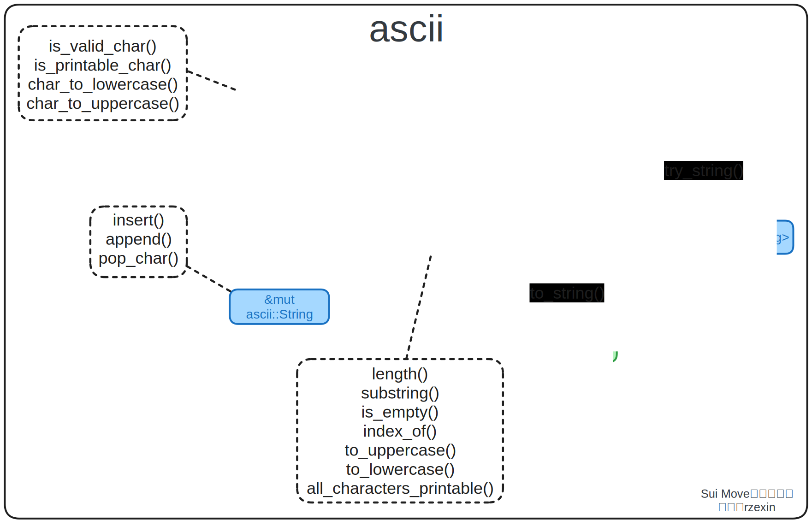

# ascii

## 模块说明

`ascii`模块定义了`Move`的`ASCII`编码字符串（`String`）和字符（`Char`）类型。并提供了一系列的操作方法，用于字符串与字节数组、字符与`u8`之间的相互转换；以及字符串的常用操作，包括：追加、截取、计算长度、判断是否为空、判断是否合法等等。

## 源码路径

https://github.com/MystenLabs/sui/blob/main/crates/sui-framework/packages/move-stdlib/sources/ascii.move

## 方法图解



## 方法说明

| 分类             | 方法                         | 说明                          |
| ---------------- | ---------------------------- | ----------------------------- |
| **类型转换方法** | `as_bytes()`                 | `ASCII`编码字符串引用转字节数组引用 |
|                  | `into_bytes()`               | `ASCII`编码字符串转字节数组    |
|                  | `string()`                   | 字节数组转`ASCII`编码字符串    |
|                  | `try_string()`               | 字节数组转`Option ASCII`编码字符串 |
|                  | `to_string()`                | `ASCII`编码字符串转`UTF-8`编码字符串 |
|                  | `byte()`                     | 字符转`u8`数字             |
|                  | `char()`                     | `u8`数字转字符                  |
| **字符串方法**   | `length()`                    | 计算字符串长度                |
|                  | `substring()`                | 从字符串中取子串              |
|                  | `is_empty()`                 | 判断字符串是否为空            |
|                  | `index_of()`                 | 获取子串首次出现位置          |
|                  | `to_uppercase()`             | 字符串转大些                  |
|                  | `to_lowercase()`             | 字符串转小写                  |
|                  | `all_characters_printable()` | 判断字符串是否均为可打印字符  |
|                  | `insert()`                   | 在字符串指定位置插入字符串    |
|                  | `append()`                   | 在字符串最后插入字符串        |
|                  | `pop_char()`                 | 从字符串尾部弹出字符          |
| **字符方法**     | `is_valid_char`              | 判断是否有有效字符            |
|                  | `is_printable_char`          | 判断是否是可打印字符          |

## 代码示例

```rust
module cookbook::ascii_demo {
    use std::ascii::{Self, String, Char};

    const EInvalidBookIdx: u64 = 1;

    public struct Bookshelf has key {
		id: UID,
		books: vector<Book>,
        book_count: u64
	}

    public struct Book has store {
		idx: u64,
		title: String, 
        category: Char,
	}

    public fun create_bookshelf(ctx: &mut TxContext) {
        transfer::share_object(Bookshelf {
            id: object::new(ctx),
            books: vector::empty(),
            book_count: 0,
        });
	}

    public fun add_book(
        bookshelf: &mut Bookshelf,
        title: vector<u8>,
        category: u8
    ) {

        let book_id = bookshelf.books.length();

        let book = Book {
            idx: book_id,
            title: ascii::string(title),
            category: ascii::char(category),
        };

        bookshelf.books.push_back(book);
        bookshelf.book_count = bookshelf.book_count + 1;
    }

    public fun get_books(bookshelf: &Bookshelf):  &vector<Book> {
        &bookshelf.books
    }

    public fun get_book(bookshelf: &Bookshelf, idx: u64):  &Book {
        assert!(bookshelf.books.length() > idx, EInvalidBookIdx);
        &bookshelf.books[idx]
    }

    public fun get_book_mut_ref(bookshelf: &mut Bookshelf, idx: u64):  &mut Book {
        assert!(bookshelf.books.length() > idx, EInvalidBookIdx);
        &mut bookshelf.books[idx]
    }

    public fun get_title(book: &Book): String {
        book.title
    }

    public fun get_title_ref(book: &Book): &String {
        &book.title
    }

    public fun get_title_mut_ref(book: &mut Book): &mut String {
        &mut book.title
    }

    public fun get_category(book: &Book): Char {
        book.category
    }
}

#[test_only]
module cookbook::ascii_demo_test {
    use std::ascii;
    use std::string;
    use sui::test_scenario as ts;
    use cookbook::ascii_demo::{Bookshelf, create_bookshelf, add_book, get_books};

    #[test_only]
    use sui::test_utils::assert_eq;

    #[test]
    public fun test_ascii() {
        let alice = @0xa;    

        let mut ts = ts::begin(alice);

        {
            create_bookshelf(ts.ctx());
        };

        let expected_title = b"Mastering Bitcoin";
        let expected_category = 0x41;
        {
            ts.next_tx(alice);
            let mut bookshelf: Bookshelf = ts.take_shared();

            add_book(
                &mut bookshelf, 
                expected_title, 
                expected_category
            );

            ts::return_shared(bookshelf);
        };

        {
            ts.next_tx(alice);
            let bookshelf: Bookshelf = ts.take_shared();
            let books = bookshelf.get_books();
            assert_eq(books.length(), 1);

            {
                let book = bookshelf.get_book(0);
                let title = book.get_title();
                assert_eq(title.into_bytes(), expected_title);
                assert_eq(title, ascii::string(expected_title));
                assert_eq(option::some(title), ascii::try_string(expected_title));
                assert_eq(title.to_string(), string::utf8(expected_title));
            };

            {
                let book = bookshelf.get_book(0);
                let title_ref = book.get_title_ref();
                assert_eq(title_ref.length(), expected_title.length());
                assert_eq(title_ref.substring(10, 17), b"Bitcoin".to_ascii_string());
                assert_eq(title_ref.is_empty(), false);
                assert_eq(title_ref.index_of(&b"Bitcoin".to_ascii_string()), 10);
                assert_eq(title_ref.to_uppercase(), b"MASTERING BITCOIN".to_ascii_string());
                assert_eq(title_ref.to_lowercase(), b"mastering bitcoin".to_ascii_string());
                assert_eq(title_ref.all_characters_printable(), true);
                assert_eq(*title_ref.as_bytes(), expected_title);  // OK
                assert!(title_ref.as_bytes() == &expected_title);  // OK
                // assert_eq(title_ref.as_bytes(), &expected_title);  // ERROR assert_eq不支持引用
            };

            ts::return_shared(bookshelf);
        };

        {
            ts.next_tx(alice);
            let mut bookshelf: Bookshelf = ts.take_shared();
            let book = bookshelf.get_book_mut_ref(0);
            let title_mut_ref = book.get_title_mut_ref();

            {
                title_mut_ref.insert(17, b" and ".to_ascii_string());
                assert!(title_mut_ref == b"Mastering Bitcoin and ".to_ascii_string());

                title_mut_ref.append(b"Move".to_ascii_string());
                assert!(title_mut_ref == b"Mastering Bitcoin and Move".to_ascii_string());

                assert_eq(title_mut_ref.pop_char(), ascii::char(0x65)); // e
                assert_eq(title_mut_ref.pop_char(), ascii::char(0x76)); // v
                assert_eq(title_mut_ref.pop_char(), ascii::char(0x6F)); // o
                assert_eq(title_mut_ref.pop_char(), ascii::char(0x4D)); // M

                assert!(title_mut_ref == b"Mastering Bitcoin and ".to_ascii_string());
            };

            ts::return_shared(bookshelf);
        };

        {
            ts.next_tx(alice);
            let bookshelf: Bookshelf = ts.take_shared();
            {
                let book = bookshelf.get_book(0);
                let category = book.get_category();
                assert_eq(category.byte(), 0x41);
                assert_eq(category, ascii::char(0x41));

                assert_eq(ascii::is_valid_char(0x41), true);
                assert_eq(ascii::is_printable_char(0x41), true);
                assert_eq(ascii::is_printable_char(0x7F), false);
            };

            ts::return_shared(bookshelf);
        };

        ts.end();
    }
}
```

