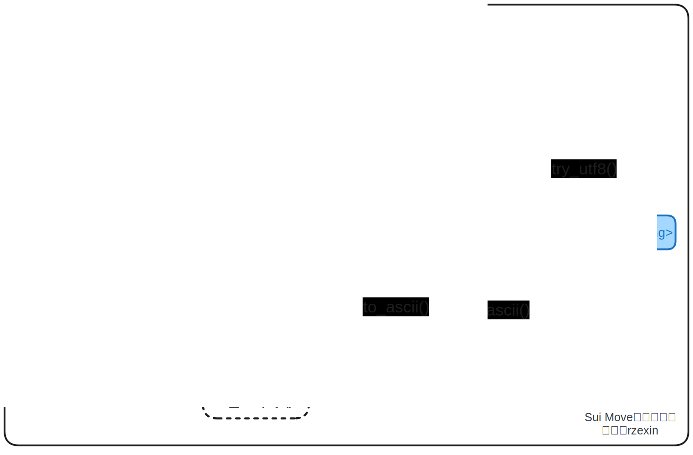

# utf8

## 模块说明

`string`模块定义了`Move`的`UTF-8`编码字符串（`String`）。并提供了一系列的操作方法，用于`UTF-8`编码字符串与字节数组以及`ASCII`编码字符串之间相互转换；以及字符串的常用操作，包括：追加、截取、计算长度、判断是否为空等等。

## 源码路径

https://github.com/MystenLabs/sui/blob/main/crates/sui-framework/packages/move-stdlib/sources/string.move

## 方法图解



## 方法说明

| 分类             | 方法                         | 说明                          |
| ---------------- | -------------------| ----------------------------- |
| **类型转换方法**   | `as_bytes()`       | `UTF8`编码字符串引用转字节数组引用 |
|                  | `into_bytes()`     | `UTF8`编码字符串转字节数组      |
|                  | `utf8()`           | 字节数组转`UTF8`编码字符串      |
|                  | `try_utf8()`       | 字节数组转`Option UTF8`编码字符串 |
|                  | `to_ascii()`       | `UTF8`编码字符串转`ASCII`编码字符串 |
|                  | `from_ascii()`     | `ASCII`编码字符串转`UTF8`编码字符串 |
| **字符串方法**     | `length()`         | 计算字符串长度                |
|                  | `substring()`      | 从字符串中取子串              |
|                  | `is_empty()`       | 判断字符串是否为空            |
|                  | `index_of()`       | 获取子串首次出现位置          |
|                  | `insert()`         | 在字符串指定位置插入`UTF8`编码字符串，指定位置必须位于有效的`UTF8`字符边界 |
|                  | `append()`         | 在`UTF8`编码字符串最后追加`UTF8`编码字符串 |
|                  | `append_utf8()`    | 在`UTF8`编码字符串最后追加字节数组，该字节数组需要为有效的`UTF8`编码 |

## 代码示例

```rust
module cookbook::utf8_demo {
    use std::string::{Self, String};

    const EInvalidBookIdx: u64 = 1;

    public struct Bookshelf has key {
		id: UID,
		books: vector<Book>,
        book_count: u64
	}

    public struct Book has store {
		idx: u64,
		title: String, 
	}

    public fun create_bookshelf(ctx: &mut TxContext) {
        transfer::share_object(Bookshelf {
            id: object::new(ctx),
            books: vector::empty(),
            book_count: 0,
        });
	}

    public fun add_book(
        bookshelf: &mut Bookshelf,
        title: vector<u8>,
    ) {

        let book_id = bookshelf.books.length();

        let book = Book {
            idx: book_id,
            title: string::utf8(title),
        };

        bookshelf.books.push_back(book);
        bookshelf.book_count = bookshelf.book_count + 1;
    }

    public fun get_books(bookshelf: &Bookshelf):  &vector<Book> {
        &bookshelf.books
    }

    public fun get_book(bookshelf: &Bookshelf, idx: u64):  &Book {
        assert!(bookshelf.books.length() > idx, EInvalidBookIdx);
        &bookshelf.books[idx]
    }

    public fun get_book_mut_ref(bookshelf: &mut Bookshelf, idx: u64):  &mut Book {
        assert!(bookshelf.books.length() > idx, EInvalidBookIdx);
        &mut bookshelf.books[idx]
    }

    public fun get_title(book: &Book): String {
        book.title
    }

    public fun get_title_ref(book: &Book): &String {
        &book.title
    }

    public fun get_title_mut_ref(book: &mut Book): &mut String {
        &mut book.title
    }
}

#[test_only]
module cookbook::utf8_demo_test {
    use std::string;
    use sui::test_scenario as ts;
    use cookbook::utf8_demo::{Bookshelf, create_bookshelf, add_book, get_books};

    #[test_only]
    use sui::test_utils::assert_eq;

    #[test]
    public fun test_utf8() {
        let alice = @0xa;    

        let mut ts = ts::begin(alice);

        {
            create_bookshelf(ts.ctx());
        };

        let expected_title = b"Mastering Bitcoin";
        let expected_title2 = b"精通比特币";
        {
            ts.next_tx(alice);
            let mut bookshelf: Bookshelf = ts.take_shared();

            add_book(
                &mut bookshelf, 
                expected_title, 
            );

            add_book(
                &mut bookshelf, 
                expected_title2, 
            );

            ts::return_shared(bookshelf);
        };

        {
            ts.next_tx(alice);
            let bookshelf: Bookshelf = ts.take_shared();
            let books = bookshelf.get_books();
            assert_eq(books.length(), 2);

            {
                let book = bookshelf.get_book(0);
                let title = book.get_title();
                assert_eq(title.into_bytes(), expected_title);
                assert_eq(title, string::utf8(expected_title));
                assert_eq(option::some(title), string::try_utf8(expected_title));
                assert_eq(title.to_ascii(), expected_title.to_ascii_string());
                assert_eq(title, expected_title.to_ascii_string().to_string());
            };

            {
                let book = bookshelf.get_book(1);
                let title_ref = book.get_title_ref();
                assert_eq(title_ref.is_empty(), false);
                assert_eq(title_ref.length(), expected_title2.length());
                assert_eq(title_ref.index_of(&b"比特币".to_string()), 6);
                assert_eq(title_ref.substring(6, 15), b"比特币".to_string());
            };

            ts::return_shared(bookshelf);
        };

        {
            ts.next_tx(alice);
            let mut bookshelf: Bookshelf = ts.take_shared();
            let book = bookshelf.get_book_mut_ref(1);
            let title_mut_ref = book.get_title_mut_ref();

            {
                title_mut_ref.append_utf8(b"和");
                assert!(title_mut_ref == b"精通比特币和".to_string());

                title_mut_ref.append(b"Move".to_string());
                assert!(title_mut_ref == b"精通比特币和Move".to_string());

                title_mut_ref.insert(15, b" ".to_string());
                title_mut_ref.insert(19, b" ".to_string());
                assert!(title_mut_ref == b"精通比特币 和 Move".to_string());
            };

            ts::return_shared(bookshelf);
        };

        ts.end();
    }
}
```

