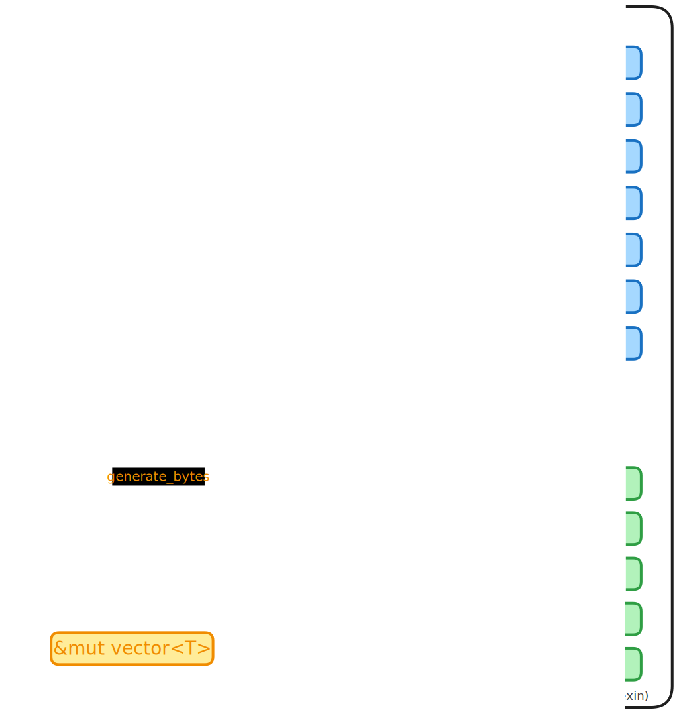
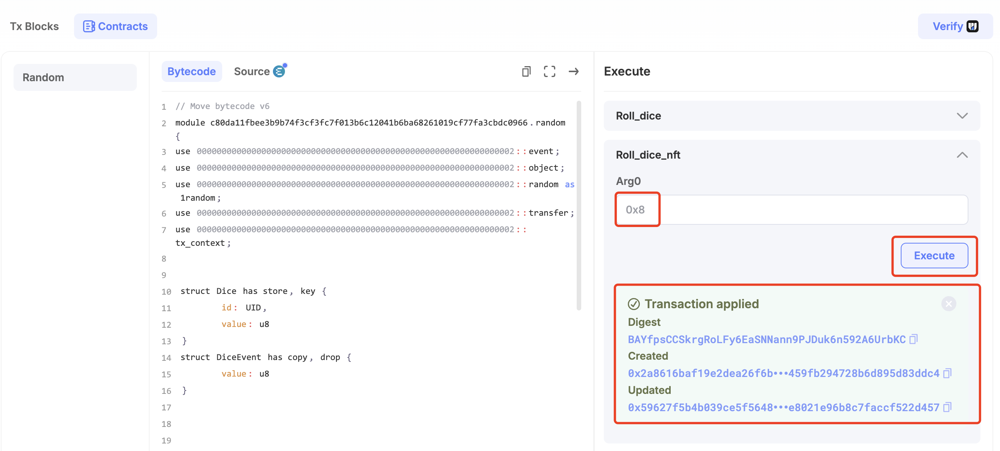
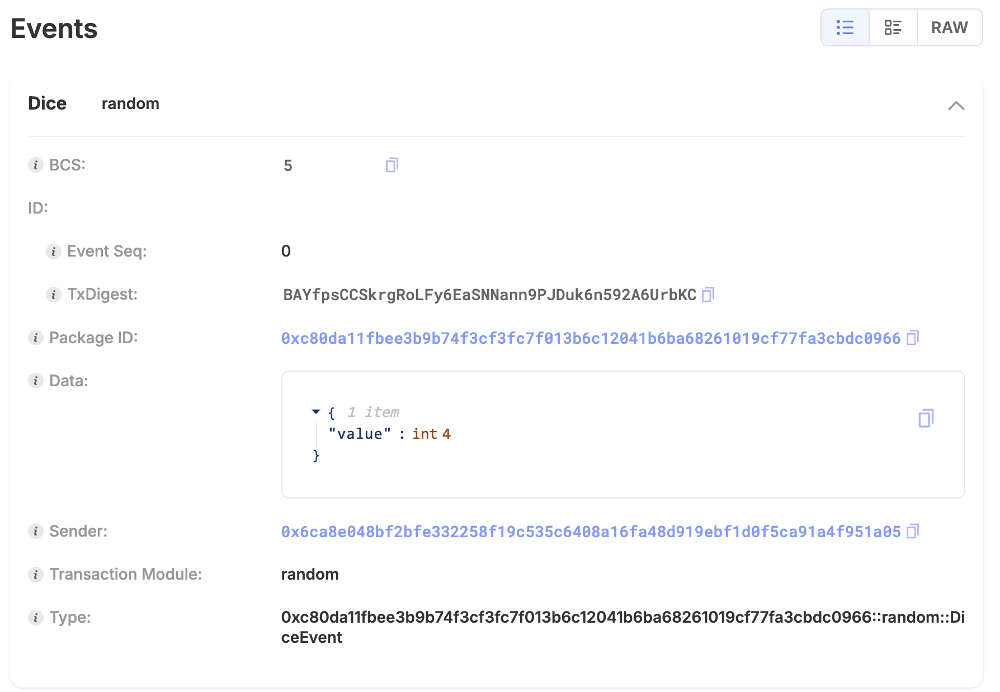
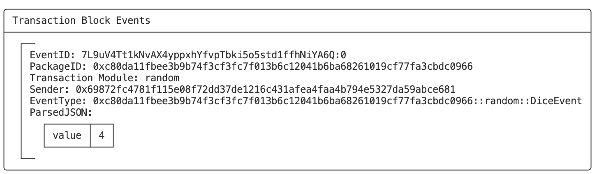

# random

## 模块说明

随机数常见于区块链游戏、彩票类、抽奖类等智能合约中，以确保公正性和公平性。

### 场景

-   **NFT**：在铸造NFT时随机分配属性，如稀有度或独特特征等

-   **游戏**：游戏战斗中的随机元素，如：开启宝箱随机宝物，随机进入游戏场景等

-   **彩票或抽奖**：彩票随机开奖或抽取中奖者

-   **协议**：随机选举领导者或随机分配收益等

### 分类

>   其中**链下随机数**需要依赖外部第三方的服务，安全性和可靠性受第三方服务限制。
>
>   **链上随机数**包括不安全随机数如：**时间戳**、**交易哈希**等，它们是可预测和可操控的，以及`Sui`原生的链上安全随机数**random**。

-   **链上随机数**
    -   **时间戳**
    -   **交易哈希**
    -   **random**
-   **链下随机数**
    -   **预言机（如：`weather-oracle`）**
    -   **第三方服务（如：`drand`）**

### 特点

`Sui`原生的链上随机数**random（0x8）**，它具备以下特点：

-   **安全**
-   **快速**
-   **去中心化**
-   **简单易用**
-   **无需信任第三方**

## 源码路径

-   [random.move](https://github.com/MystenLabs/sui/blob/main/crates/sui-framework/packages/sui-framework/sources/random.move)

-   [example](https://github.com/MystenLabs/sui/tree/main/examples/move/random)

## 方法图解



## 最佳实践

**（1）使用私有的`entry`函数，不要使用`public entry`**

**（2）使用函数内直接创建的`RandomGenerator`，不要作为参数传递**

**（3）确保意外路径（`unhappy path`）不会比预期路径（`happy path`）消耗更多`gas`**

**（4）将获取随机数和使用随机数函数分开**

**（5）防止`PTB`级别的组合攻击（编译器）**

>   `Sui`在使用`Random`作为输入的`MoveCall`命令之后拒绝了具有非`TransferObjects`或`MergeCoins`命令的`PTB`

## 代码示例

以下是一个投骰子的示例，每次调用将会得到一个1~6的随机数NFT。

```move
module cookbook::random{
    use sui::random::{Self, Random, new_generator};
    use sui::event;

    public struct Dice has key, store {
        id: UID,
        value: u8,
    }

    public struct DiceEvent has copy, drop {
        value: u8,
    }

    entry fun roll_dice(r: &Random, ctx: &mut TxContext): u8 {
        let mut generator = new_generator(r, ctx); 
        let result = random::generate_u8_in_range(&mut generator, 1, 6);
        result
    }

    entry fun roll_dice_nft(r: &Random, ctx: &mut TxContext) {
        let value = roll_dice(r, ctx);
        let dice = Dice {
            id: object::new(ctx),
            value,
        };

        event::emit(DiceEvent { value });

        transfer::transfer(dice, tx_context::sender(ctx));
    }
}
```

## 合约操作

### 合约部署

```bash
$ sui client publish
```

-   **记录合约包ID**

```bash
export PACKAGE_ID=0xc80da11fbee3b9b74f3cf3fc7f013b6c12041b6ba68261019cf77fa3cbdc0966
```

### 浏览器调用

https://suiscan.xyz/testnet/tx/BAYfpsCCSkrgRoLFy6EaSNNann9PJDuk6n592A6UrbKC



可见得到的骰子点数为：4。



### 命令行调用

```bash
$ sui client call --package $PACKAGE_ID --module random --function roll_dice_nft --args 0x8
```

可见得到的骰子点数为：4。



### 代码调用

```js
import { Ed25519Keypair } from "@mysten/sui/keypairs/ed25519";
import { SuiClient } from "@mysten/sui/client";
import { Transaction } from "@mysten/sui/transactions";

import dotenv from "dotenv";
dotenv.config();
const MNEMONIC = process.env.MNEMONIC!;
const keypair = Ed25519Keypair.deriveKeypair(MNEMONIC);

const PACKAGE_ID =
  "0xc80da11fbee3b9b74f3cf3fc7f013b6c12041b6ba68261019cf77fa3cbdc0966";
const MODULE_NAME = "random";
const FUNCTION_NAME = "roll_dice_nft";
const FULLNODE_URL = "https://fullnode.testnet.sui.io:443";

const SUI_CLIENT = new SuiClient({ url: FULLNODE_URL });

(async () => {
  let tx = new Transaction();
  tx.moveCall({
    target: `${PACKAGE_ID}::${MODULE_NAME}::${FUNCTION_NAME}`,
    arguments: [tx.object("0x8")],
  });

  try {
    const result = await SUI_CLIENT.signAndExecuteTransaction({
      transaction: tx,
      signer: keypair,
      options: {
        showEvents: true,
      },
    });

    console.log(
      `signAndExecuteTransactionBlock result: ${JSON.stringify(
        result,
        null,
        2
      )}`
    );
  } catch (e) {
    console.error(e);
  }
})();
```

-   **执行输出**

可见得到的骰子点数为：6。

```bash
$ ts-node client.ts 
signAndExecuteTransactionBlock result: {
  "digest": "FfG1UQHC3CiZg4aUsGjUA788gG6ZtpwXd5LKY12xYq5z",
  "events": [
    {
      "id": {
        "txDigest": "FfG1UQHC3CiZg4aUsGjUA788gG6ZtpwXd5LKY12xYq5z",
        "eventSeq": "0"
      },
      "packageId": "0xc80da11fbee3b9b74f3cf3fc7f013b6c12041b6ba68261019cf77fa3cbdc0966",
      "transactionModule": "random",
      "sender": "0xa244617bc05e4122fb825d3b9c63dbad96dd06fae8183c2f03027b1feff12028",
      "type": "0xc80da11fbee3b9b74f3cf3fc7f013b6c12041b6ba68261019cf77fa3cbdc0966::random::DiceEvent",
      "parsedJson": {
        "value": 6
      },
      "bcs": "7"
    }
  ],
  "confirmedLocalExecution": false
}
```

## 更多资料

https://docs.sui.io/guides/developer/advanced/randomness-onchain

https://www.youtube.com/watch?v=GxWk5WDnoD0