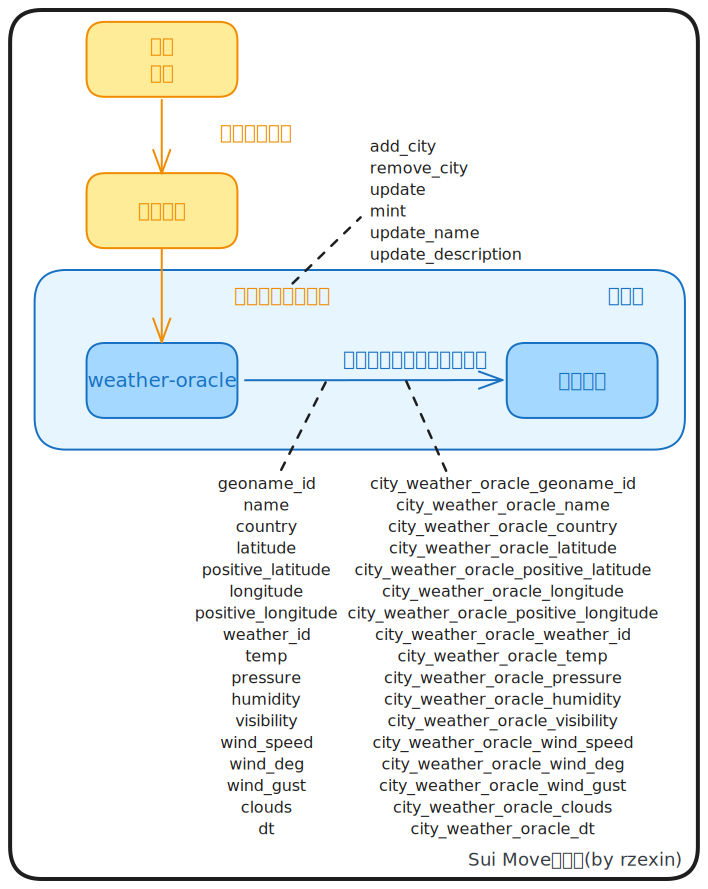
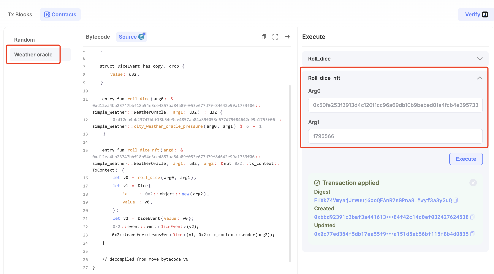
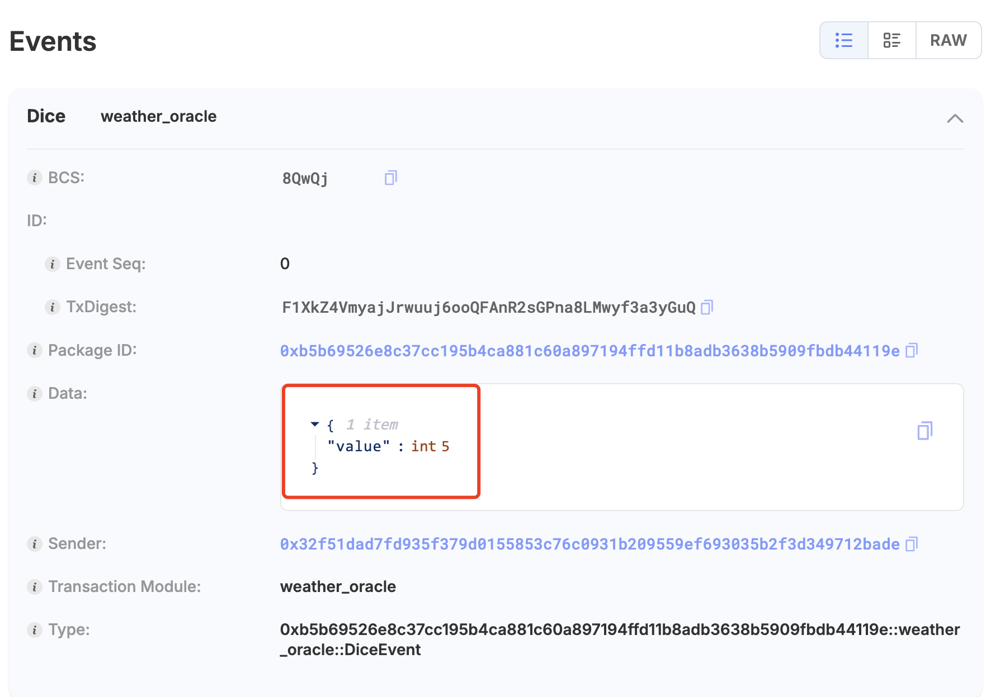
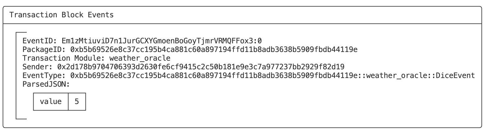

# oracle

## 模块说明

本文将介绍和使用`Sui`官方提供的 **天气预言机[weather-oracle](https://github.com/MystenLabs/apps/blob/main/weather-oracle/README.md)** 进行随机数的创建。

>   注：因目前官方提供的部署在主网上的天气预言机版本比较老，已经无法正常使用了，故本示例中将在测试网上部署一个简化版本来演示。期待官方后续进行下更新。

## 源码路径

-   [weather.move](https://github.com/MystenLabs/apps/blob/main/weather-oracle/sources/weather.move)

## 方法图解



## 代码示例

以下同样是投骰子的示例，每次调用将通过天气预言机得到一个 1~6 的随机数 NFT。

```move
{{#include ./codes/cookbook/sources/weather_oracle.move}}
```

## 合约操作

### 前置准备
因官方的天气预言机已经无法正常使用，故个人在测试网部署一个简化版本，进行测试。待官方升级后，使用方式类似。

具体步骤如下：

#### （1）编写简化版weather-oracle合约

```move
{{#include ./codes/simple_weather_oracle/sources/simple_weather_oracle.move}}
```

#### （2）部署简化版weather-oracle合约

```bash
$ sui client publish
```

-   **记录关键对象**

```bash
export PACKAGE_ID=0xd12ea4bb23747bbf18b54e3ce4857aa84a89f053e677d79f84642e99a1753f06

export WEATHER_ORACLE=0x50fe253f3913d4c120f1cc96a69db10b9bebed01a4fcb4e3957336f33d9fa4c3

export ADMIN_CAP=0x02714caa89b4d990321035c0d946c650bb5e20f3a73679cfc3ce2de15bb00103
```

#### （3）修改Move.toml

-   **将PACKAGE_ID更新到Move.toml**

```toml
[package]
name = "simple_weather_oracle"
edition = "2024.beta"  
version = "1.0.0"
published-at = "0xd12ea4bb23747bbf18b54e3ce4857aa84a89f053e677d79f84642e99a1753f06"

[dependencies]
Sui = { git = "https://github.com/MystenLabs/sui.git", subdir = "crates/sui-framework/packages/sui-framework", rev = "framework/testnet" }

[addresses]
oracle = "0xd12ea4bb23747bbf18b54e3ce4857aa84a89f053e677d79f84642e99a1753f06"
```

#### （4）提交简化版weather-oracle到github

#### （5）添加城市

```bash
$ export GEO_NAME_ID_SZ=1795566

$ sui client call --package $PACKAGE_ID --module simple_weather --function add_city --args $ADMIN_CAP $WEATHER_ORACLE $GEO_NAME_ID_SZ Shenzhen CN 
```

#### （6）更新气压值

```bash
$ sui client call --package $PACKAGE_ID --module simple_weather --function update --args $ADMIN_CAP $WEATHER_ORACLE $GEO_NAME_ID_SZ 99700
```

#### （7）获取气压值

```bash
$ sui client call --package $PACKAGE_ID --module simple_weather --function city_weather_oracle_pressure --args $WEATHER_ORACLE $GEO_NAME_ID_SZ
```

### 业务合约部署

```bash
$ sui client publish
```

- **记录关键信息**

```bash
export PACKAGE_ID=0xb5b69526e8c37cc195b4ca881c60a897194ffd11b8adb3638b5909fbdb44119e
```

### 浏览器调用

https://suiscan.xyz/testnet/object/0xb5b69526e8c37cc195b4ca881c60a897194ffd11b8adb3638b5909fbdb44119e/contracts



可见得到的骰子点数为：5：

https://suiscan.xyz/testnet/tx/F1XkZ4VmyajJrwuuj6ooQFAnR2sGPna8LMwyf3a3yGuQ



### 命令行调用

```bash
$ sui client call --package $PACKAGE_ID --module weather_oracle --function roll_dice_nft --args $WEATHER_ORACLE $GEO_NAME_ID_SZ
```

可见得到的骰子点数为：5。



### 代码调用

```ts
{{#include ./codes/cookbook/client/client_weather_oracle.ts}}
```

- **执行输出**

可见得到的骰子点数为：5。

```bash
$ ts-node client_weather_oracle.ts 
signAndExecuteTransactionBlock result: {
  "digest": "E9MYantGeDx4XaWDhpBzCMELsLm3WeB5uq2SqGHfiaWb",
  "events": [
    {
      "id": {
        "txDigest": "E9MYantGeDx4XaWDhpBzCMELsLm3WeB5uq2SqGHfiaWb",
        "eventSeq": "0"
      },
      "packageId": "0xb5b69526e8c37cc195b4ca881c60a897194ffd11b8adb3638b5909fbdb44119e",
      "transactionModule": "weather_oracle",
      "sender": "0xa244617bc05e4122fb825d3b9c63dbad96dd06fae8183c2f03027b1feff12028",
      "type": "0xb5b69526e8c37cc195b4ca881c60a897194ffd11b8adb3638b5909fbdb44119e::weather_oracle::DiceEvent",
      "parsedJson": {
        "value": 5
      },
      "bcs": "8QwQj"
    }
  ],
  "confirmedLocalExecution": false
}
```

## 更多资料

https://docs.sui.io/guides/developer/app-examples/weather-oracle

https://blog.sui.io/sui-weather-oracle/

