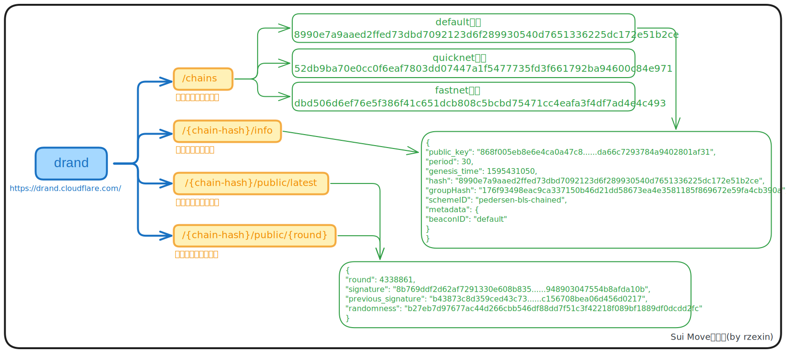
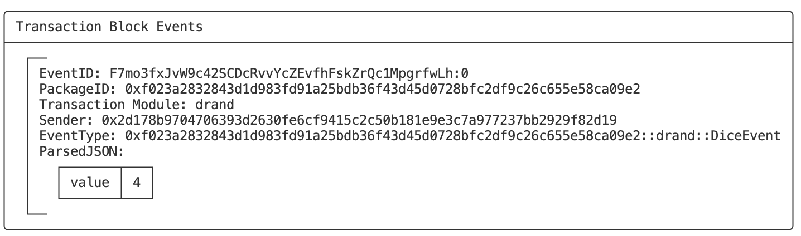

# drand

## 模块说明

-   **定义**

    [Drand](https://drand.love/)是一个**分布式随机性信标（Distributed randomness beacon）**，提供**公开可验证、不可预测且无偏的随机数**服务。

-   **获取方式**

    可以通过向`Drand`服务发送`HTTP GET`请求来获取随机数，还可以使用客户端库（`GO、JS`）为应用程序获取随机数。

-   **公共端点**

    | Provider      | URL                                    |
    | ------------- | -------------------------------------- |
    | Protocol Labs | https://api.drand.sh/                  |
    |               | https://api2.drand.sh/                 |
    |               | https://api3.drand.sh/                 |
    | Cloudflare    | https://drand.cloudflare.com/          |
    | StorSwift     | https://api.drand.secureweb3.com:6875/ |

-   **网络分类**

    | 分类         | 随机数产生频率 | 网络模式                       | 生成方式                                   | 安全性 | 性能 |
    | ------------ | -------------- | ------------------------------ | ------------------------------------------ | ------ | ---- |
    | **默认网络** | 30s            | 链式模式（`chained mode`）     | 每个随机数依赖于前一个随机数，形成随机数链 | 较高   | 较低 |
    | **快速网络** | 3s             | 非链式模式（`unchained mode`） | 每个随机数独立生成，不依赖于之前的随机数   | 较低   | 较高 |

## 方法图解

https://drand.love/docs/http-api-reference



## 代码示例

以下同样是投骰子的示例，每次调用将通过传入`drand`随机数得到一个 1~6 的随机数 NFT。

```move
{{#include ./codes/cookbook/sources/drand.move}}
```

## 合约操作

### 业务合约部署

```bash
$ sui client publish
```

- **记录关键信息**

```bash
export PACKAGE_ID=0xf023a2832843d1d983fd91a25bdb36f43d45d0728bfc2df9c26c655e58ca09e2
```

### 命令行调用

```bash
# 获取最新轮次和随机数签名
$ curl -s https://drand.cloudflare.com/52db9ba70e0cc0f6eaf7803dd07447a1f5477735fd3f661792ba94600c84e971/public/latest > output.txt
$ export CURRENT_ROUND=`jq '.round' output.txt`
$ export SIGNATURE=0x`jq -r '.signature' output.txt`

$ cat output.txt | jq
{
  "round": 10938210,
  "signature": "a23596a3f17b8c3553cbb590b6f11081603ab909d5603db45134c7aa9977c3bf9dfa0681144b8dfa8fed4452e9c2204d",
  "randomness": "d6e5474b7c1e27b09791bb9b483d16d9e01a7df2f1645b847ddae381ef0c6647"
}

$ sui client call --package $PACKAGE_ID --module drand --function roll_dice_nft --args $CURRENT_ROUND $SIGNATURE
```

可见得到的骰子点数为：4。



### 代码调用

```ts
{{#include ./codes/cookbook/client/client_drand.ts}}
```

- **执行输出**

可见得到的骰子点数为：6。

```bash
$ ts-node client_drand.ts 
signAndExecuteTransactionBlock result: {
  "digest": "GwP6FhHwLbS1LvSP4r7YzqZ9ucPYuQKqiXdEmpkNEBQf",
  "events": [
    {
      "id": {
        "txDigest": "GwP6FhHwLbS1LvSP4r7YzqZ9ucPYuQKqiXdEmpkNEBQf",
        "eventSeq": "0"
      },
      "packageId": "0xe94fae15e81744ec0d64c45de6efe8feeb7e14d9894b20316d7e57b7a8274ad0",
      "transactionModule": "drand",
      "sender": "0xa244617bc05e4122fb825d3b9c63dbad96dd06fae8183c2f03027b1feff12028",
      "type": "0xe94fae15e81744ec0d64c45de6efe8feeb7e14d9894b20316d7e57b7a8274ad0::drand::DiceEvent",
      "parsedJson": {
        "value": 6
      },
      "bcs": "7"
    }
  ],
  "confirmedLocalExecution": false
}
```


