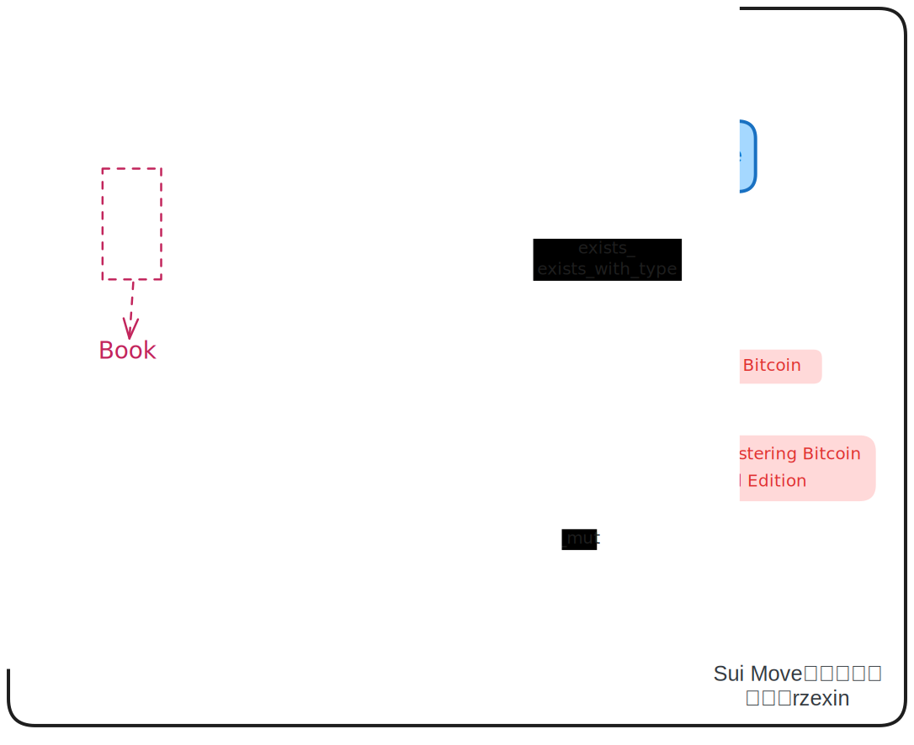

# dynamic_field

## 模块说明

`dynamic_field(动态字段)`模块定义将结构体和值组合在一起的方式，可以在运行时动态进行添加和删除。任何具有 `store` 能力的值都可以被存储。可以不具备`key`能力，即不可直接从外部进行访问。

## 源码路径

https://github.com/MystenLabs/sui/blob/main/crates/sui-framework/packages/sui-framework/sources/dynamic_field.move

## 方法图解



## 方法说明

| 分类   | 方法                                                   | 说明                                                         |
| ------ | ------------------------------------------------------ | ------------------------------------------------------------ |
| **增** | `add<...>(object: &mut UID, name: Name, value: Value)` | 向对象`object`添加名为`name`的值为`value`的动态字段          |
| **删** | `remove<...>(object: &mut UID, name: Name)`            | 从对象`object`中删除名为`name`的动态字段，若不存在将会报错   |
|        | `remove_if_exists<...>(object: &mut UID, name: Name)`  | 从对象`object`中删除名为`name`的动态字段，若存在则已`option::some`包装后返回，若不存在返回`option::none()` |
| **改** | `borrow_mut<...>(object: &mut UID, name: Name)`        | 从对象`object`中获取名为`name`的动态字段的可变引用，以便进行对动态字段的修改 |
| **查** | `borrow<...>(object: &UID, name: Name)`                | 从对象`object`中获取名为`name`的动态字段的只读引用，用于进行信息查看 |
|        | `exists_<...>(object: &UID, name: Name)`               | 若对象`object`中存在名为`name`的动态字段则返回`true`，无需指定`value`类型 |
|        | `exists_with_type<...>(object: &UID, name: Name)`      | 若对象`object`中存在名为`name`的动态字段则返回`true`，需指定`value`类型 |

## 代码示例

采用书架和书本的示例，书本对象作为动态字段添加到书架上。

### 结构定义

```rust
    // 书架结构定义
    public struct Bookshelf has key {
        id: UID,
        // 书本数量
        book_count: u64
    }

    // 书本结构定义
    public struct Book has store {
        // 书本标题
        title: String, 
        // 书本描述
        description: String,
    }
```

### 创建书架共享对象

```rust
    public fun create_bookshelf(ctx: &mut TxContext) {
        transfer::share_object(Bookshelf {
            id: object::new(ctx),
            book_count: 0,
        });
	}
```

### 添加书本到书架

>   调用`dynamic_field::add`方法。

```rust
    public fun add_book(bookshelf: &mut Bookshelf, title: vector<u8>, description: vector<u8>) {
        let book = Book {
            title: ascii::string(title),
            description: ascii::string(description)
        };

        dynamic_field::add(&mut bookshelf.id,title, book); 
        bookshelf.book_count = bookshelf.book_count + 1;
    }
```

### 获取书本

>   调用`dynamic_field::borrow`方法。

```rust
    public fun get_book(bookshelf: &Bookshelf, title: vector<u8>): &Book {
        dynamic_field::borrow(&bookshelf.id, title)
    }
```

### 设置书本的描述信息

>   调用`dynamic_field::borrow_mut`方法。

```rust
    public fun set_book_desc(bookshelf: &mut Bookshelf, title: vector<u8>, description: vector<u8>) {
        let book_mut_ref: &mut Book = dynamic_field::borrow_mut(&mut bookshelf.id, title);
        book_mut_ref.description = ascii::string(description);
    }
```

### 判断书本是否存在

>   调用`dynamic_field::exists_`和`dynamic_field::exists_with_type`方法。

```rust
    public fun is_book_existed(bookshelf: &Bookshelf, title: vector<u8>): bool {
        dynamic_field::exists_(&bookshelf.id, title)
    }

    public fun is_book_exists_with_type(bookshelf: &Bookshelf, title: vector<u8>): bool {
        dynamic_field::exists_with_type<vector<u8>, Book>(&bookshelf.id, title)
    }
```

### 从书架上移除书本

>   调用`dynamic_field::remove`和`dynamic_field::remove_if_exists`方法。

```rust
    public fun remove_book(bookshelf: &mut Bookshelf, title: vector<u8>): Book {
        bookshelf.book_count = bookshelf.book_count - 1;
        dynamic_field::remove<vector<u8>, Book>(&mut bookshelf.id, title)
    }

    public fun remove_if_book_exists(bookshelf: &mut Bookshelf, title: vector<u8>): Option<Book> {
        bookshelf.book_count = bookshelf.book_count - 1;
        dynamic_field::remove_if_exists<vector<u8>, Book>(&mut bookshelf.id, title)
    }
```

## 完整代码

```rust
module cookbook::dynamic_field{
    use std::ascii::{Self, String};
    use sui::dynamic_field;

    public struct Bookshelf has key {
        id: UID,
        book_count: u64
    }

    public struct Book has store {
        title: String, 
        description: String,
    }

    // 创建书架共享对象
    public fun create_bookshelf(ctx: &mut TxContext) {
        transfer::share_object(Bookshelf {
            id: object::new(ctx),
            book_count: 0,
        });
	}

    // 添加书本到书架
    public fun add_book(bookshelf: &mut Bookshelf, title: vector<u8>, description: vector<u8>) {
        let book = Book {
            title: ascii::string(title),
            description: ascii::string(description)
        };

        dynamic_field::add<vector<u8>, Book>(&mut bookshelf.id,title, book); 
        bookshelf.book_count = bookshelf.book_count + 1;
    }

    public fun add_book_obj(bookshelf: &mut Bookshelf, book: Book) {
        dynamic_field::add<vector<u8>, Book>(&mut bookshelf.id,
            book.title.into_bytes(), book); 
        bookshelf.book_count = bookshelf.book_count + 1;
    }

    // 获取书本
    public fun get_book(bookshelf: &Bookshelf, title: vector<u8>): &Book {
        dynamic_field::borrow(&bookshelf.id, title)
    }

    // 设置书本的描述信息
    public fun set_book_desc(bookshelf: &mut Bookshelf, title: vector<u8>, description: vector<u8>) {
        let book_mut_ref: &mut Book = dynamic_field::borrow_mut(&mut bookshelf.id, title);
        book_mut_ref.description = ascii::string(description);
    }

    // 判断书本是否存在
    public fun is_book_existed(bookshelf: &Bookshelf, title: vector<u8>): bool {
        dynamic_field::exists_(&bookshelf.id, title)
    }

    public fun is_book_exists_with_type(bookshelf: &Bookshelf, title: vector<u8>): bool {
        dynamic_field::exists_with_type<vector<u8>, Book>(&bookshelf.id, title)
    }

    // 从书架上移除书本
    public fun remove_book(bookshelf: &mut Bookshelf, title: vector<u8>): Book {
        bookshelf.book_count = bookshelf.book_count - 1;
        dynamic_field::remove<vector<u8>, Book>(&mut bookshelf.id, title)
    }

    // 如果存在指定标题书本，则从书架上移除书本
    public fun remove_if_book_exists(bookshelf: &mut Bookshelf, title: vector<u8>): Option<Book> {
        bookshelf.book_count = bookshelf.book_count - 1;
        dynamic_field::remove_if_exists<vector<u8>, Book>(&mut bookshelf.id, title)
    }

    public fun get_book_count(bookshelf: &Bookshelf): u64{
        bookshelf.book_count
    }

    public fun get_book_title(book: &Book): String {
        book.title
    }

    public fun get_book_desc(book: &Book): String {
        book.description
    }
}
```

## 单元测试

```rust
#[test_only]
module cookbook::dynamic_field_test {
    use std::ascii;
    use sui::test_scenario as ts;
    use cookbook::dynamic_field::{Bookshelf, create_bookshelf, add_book, get_book, 
        set_book_desc, is_book_existed, is_book_exists_with_type, remove_book,
        get_book_count, get_book_title, get_book_desc};

    #[test_only]
    use sui::test_utils::assert_eq;

    #[test]
    public fun test_dynamic_field() {
        let alice = @0xa;    

        let mut ts = ts::begin(alice);

        // 创建书架
        {
            create_bookshelf(ts.ctx());
        };

        // 添加书本到书架
        let expected_title = b"Mastering Bitcoin";
        let expected_description= b"1st Edition";
        let expected_new_description= b"3rd Edition";

        {
            ts.next_tx(alice);
            let mut bookshelf: Bookshelf = ts.take_shared();

            add_book(
                &mut bookshelf, 
                expected_title, 
                expected_description,
            );

            assert_eq(bookshelf.get_book_count(), 1);

            ts::return_shared(bookshelf);
        };

        // 获取书本
        {
            ts.next_tx(alice);
            let bookshelf: Bookshelf = ts.take_shared();

            let book = get_book(
                &bookshelf, 
                expected_title, 
            );

            assert_eq(book.get_book_title(), ascii::string(expected_title));
            assert_eq(book.get_book_desc(), ascii::string(expected_description));

            ts::return_shared(bookshelf);
        };

        // 设置书本的描述信息
        {
            ts.next_tx(alice);
            let mut bookshelf: Bookshelf = ts.take_shared();

            set_book_desc(
                &mut bookshelf, 
                expected_title, 
                expected_new_description,
            );

            let book = get_book(
                &bookshelf, 
                expected_title, 
            );

            assert_eq(book.get_book_title(), ascii::string(expected_title));
            assert_eq(book.get_book_desc(), ascii::string(expected_new_description));

            ts::return_shared(bookshelf);
        };

        // 判断书本是否存在
        {
            ts.next_tx(alice);
            let bookshelf: Bookshelf = ts.take_shared();

            let is_existed = is_book_existed(
                &bookshelf, 
                expected_title, 
            );
            assert_eq(is_existed, true);

            let is_existed = is_book_exists_with_type(
                &bookshelf, 
                expected_title, 
            );
            assert_eq(is_existed, true);

            ts::return_shared(bookshelf);
        };

        // 从书架上移除书本
        {
            ts.next_tx(alice);
            let mut bookshelf: Bookshelf = ts.take_shared();

            assert_eq(bookshelf.get_book_count(), 1);

            let book = remove_book(
                &mut bookshelf, 
                expected_title, 
            );

            assert_eq(bookshelf.get_book_count(), 0);
            assert_eq(book.get_book_title(), ascii::string(expected_title));
            assert_eq(book.get_book_desc(), ascii::string(expected_new_description));

            bookshelf.add_book_obj(book);

            ts::return_shared(bookshelf);
        };

        ts.end();
    }
}
```

