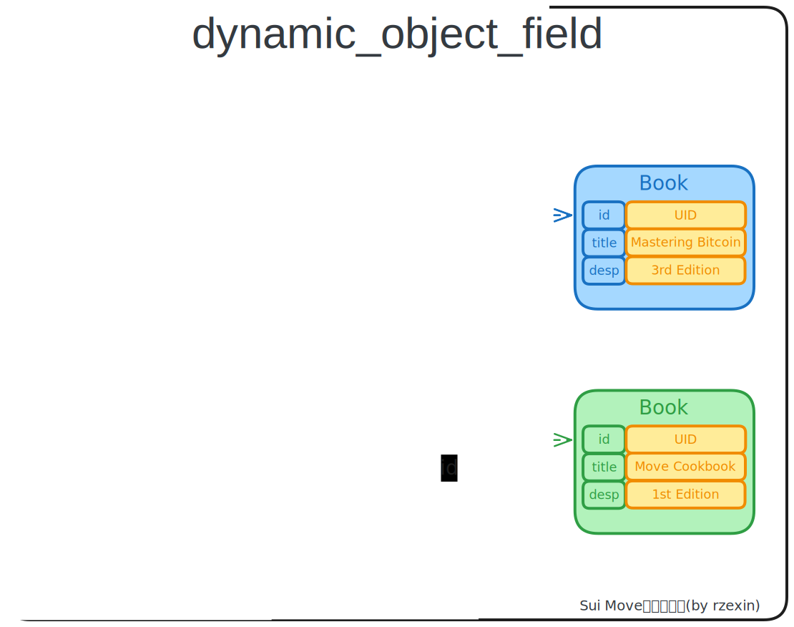

# dynamic_object_field

## 模块说明

- `dynamic_object_field(动态对象字段)`特性同`dynamic_field(动态字段)`
- 与之不同的是值必须具备`key`能力，对象仍然能从外部通过 `UID` 进行访问

## 源码路径

[dynamic_object_field.move](https://github.com/MystenLabs/sui/blob/main/crates/sui-framework/packages/sui-framework/sources/dynamic_object_field.move)

## 方法图解



## 方法说明

| 分类   | 方法                                                                   | 说明                                                                         |
| ------ | ---------------------------------------------------------------------- | ---------------------------------------------------------------------------- |
| **增** | `add<...>(object: &mut UID, name: Name, value: Value)`                 | 向对象`object`添加名为`name`的值为`value`的动态字段                          |
| **删** | `remove<...>(object: &mut UID, name: Name): Value `                    | 从对象`object`中删除名为`name`的动态字段，若不存在将会报错                   |
| **改** | `borrow_mut<...>(object: &mut UID, name: Name): &mut Value`            | 从对象`object`中获取名为`name`的动态字段的可变引用，以便进行对动态字段的修改 |
| **查** | `borrow<...>(object: &UID, name: Name): &Value`                        | 从对象`object`中获取名为`name`的动态字段的只读引用，用于进行信息查看         |
|        | `exists_<...>(object: &UID, name: Name): bool`                         | 若对象`object`中存在名为`name`的动态字段则返回`true`，无需指定`value`类型    |
|        | `exists_with_type<...>(object: &UID, name: Name): bool`                | 若对象`object`中存在名为`name`的动态字段则返回`true`，需指定`value`类型      |
|        | `id<Name: copy + drop + store>(object: &UID, name: Name,): Option<ID>` | 返回动态对象字段中的对象`ID`                                                 |

## 代码示例

同样采用书架（`Bookshelf`）和书本（`Book`）的示例，书本对象作为动态字段添加到书架上，其中书本需要具备`key`能力，该对象可以从外部通过 `UID` 进行访问。

### 结构定义

> 注：`Book`结构需要具备`key`能力，结构体中也必须具备`UID`

```move
public struct Bookshelf has key {
    id: UID,
    book_count: u64
}

public struct Book has key, store {
    id: UID,
    title: String,
    description: String,
}
```

### 创建书架共享对象

```move
// 创建书架共享对象
public fun create_bookshelf(ctx: &mut TxContext) {
    transfer::share_object(Bookshelf {
        id: object::new(ctx),
        book_count: 0,
    });
}
```

### 添加书本到书架

> 调用`dynamic_field::add`方法。

```move
// 添加书本到书架
public fun add_book(bookshelf: &mut Bookshelf, title: vector<u8>, description: vector<u8>, ctx: &mut TxContext) {
    let book = Book {
        id: object::new(ctx),
        title: ascii::string(title),
        description: ascii::string(description)
    };

    dynamic_object_field::add<vector<u8>, Book>(&mut bookshelf.id,title, book);
    bookshelf.book_count = bookshelf.book_count + 1;
}

public fun add_book_obj(bookshelf: &mut Bookshelf, book: Book) {
    dynamic_object_field::add<vector<u8>, Book>(&mut bookshelf.id,
        book.title.into_bytes(), book);
    bookshelf.book_count = bookshelf.book_count + 1;
}
```

### 获取书本

> 调用`dynamic_field::borrow`方法。

```move
// 获取书本
public fun get_book(bookshelf: &Bookshelf, title: vector<u8>): &Book {
    dynamic_object_field::borrow(&bookshelf.id, title)
}
```

### 设置书本的描述信息

> 调用`dynamic_field::borrow_mut`方法。

```move
// 设置书本的描述信息
public fun set_book_desc(bookshelf: &mut Bookshelf, title: vector<u8>, description: vector<u8>) {
    let book_mut_ref: &mut Book = dynamic_object_field::borrow_mut(&mut bookshelf.id, title);
    book_mut_ref.description = ascii::string(description);
}
```

### 判断书本是否存在

> 调用`dynamic_field::exists_`和`dynamic_field::exists_with_type`方法。

```move
public fun is_book_existed(bookshelf: &Bookshelf, title: vector<u8>): bool {
    dynamic_object_field::exists_(&bookshelf.id, title)
}

public fun is_book_exists_with_type(bookshelf: &Bookshelf, title: vector<u8>): bool {
    dynamic_object_field::exists_with_type<vector<u8>, Book>(&bookshelf.id, title)
}
```

### 从书架上移除书本

> 调用`dynamic_field::remove`和`dynamic_field::remove_if_exists`方法。

```move
// 从书架上移除书本
public fun remove_book(bookshelf: &mut Bookshelf, title: vector<u8>): Book {
    bookshelf.book_count = bookshelf.book_count - 1;
    dynamic_object_field::remove<vector<u8>, Book>(&mut bookshelf.id, title)
}
```

## 完整代码

- **dynamic_object_field**

```move
{{#include ./codes/cookbook/sources/dynamic_object_field.move}}
```

- **dynamic_field_tests**

```move
{{#include ./codes/cookbook/tests/dynamic_object_field_tests.move}}
```
