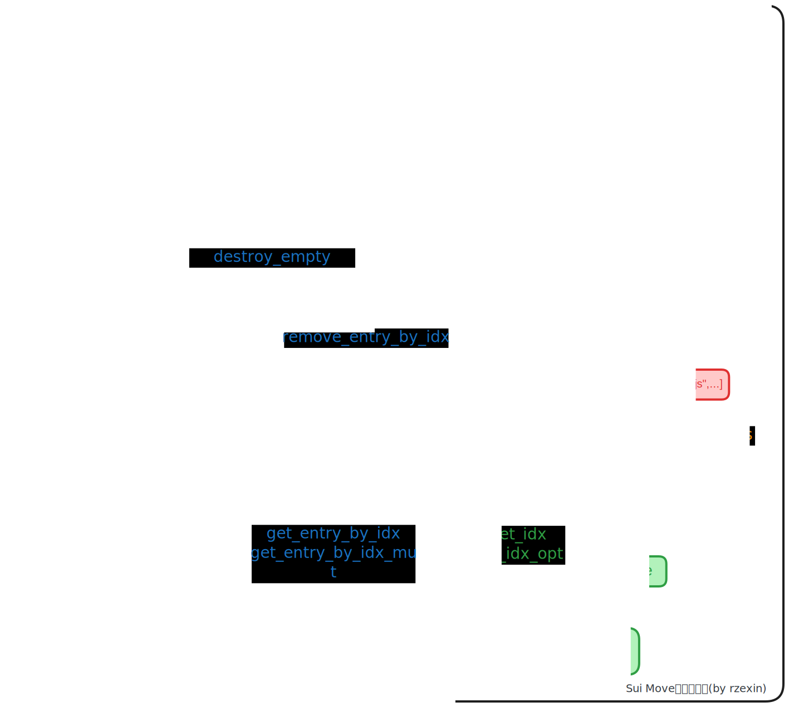

# vec_map & vec_set

## 模块说明

- `Sui` 的 **映射（vec_map）** 和 **集合（vec_set）** 是基于**vector**实现的数据结构
- `vec_map` 是一种映射结构，保证不包含重复的键，但是条目按照插入顺序排列，而不是按键的顺序。
- `vec_set` 是一种集合结构，保证不包含重复的键。
- 所有的操作时间复杂度为 `O(N)`，`N` 为映射或集合的大小
- 该结构提供方便的操作映射或集合的接口，如何需要按键的顺序排序的映射都需要手工额外处理

## 源码路径

- [vec_map.move](https://github.com/MystenLabs/sui/blob/main/crates/sui-framework/packages/sui-framework/sources/vec_map.move)
- [vec_set.move](https://github.com/MystenLabs/sui/blob/main/crates/sui-framework/packages/sui-framework/sources/vec_set.move)

## 方法图解



## 结构定义

### VecMap

```move
public struct VecMap<K: copy, V> has copy, drop, store {
    contents: vector<Entry<K, V>>,
}

/// An entry in the map
public struct Entry<K: copy, V> has copy, drop, store {
    key: K,
    value: V,
}
```

### VecSet

```move
public struct VecSet<K: copy + drop> has copy, drop, store {
    contents: vector<K>,
}
```

## 方法说明

| 功能                           | vec_map                                                                                                                                                                                                | vec_set                                                                                                                                   |
| ------------------------------ | ------------------------------------------------------------------------------------------------------------------------------------------------------------------------------------------------------ | ----------------------------------------------------------------------------------------------------------------------------------------- |
| **创建空结构**                 | `empty<K: copy, V>(): VecMap<K,V>`                                                                                                                                                                     | `empty<K: copy + drop>(): VecSet<K>`                                                                                                      |
| **创建单元素结构**             | ❎                                                                                                                                                                                                     | `singleton<K: copy + drop>(key: K): VecSet<K>`                                                                                            |
| **插入元素**                   | `insert<K: copy, V>(self: &mut VecMap<K,V>, key: K, value: V) `                                                                                                                                        | `insert<K: copy + drop>(self: &mut VecSet<K>, key: K)`                                                                                    |
| **移除元素**                   | `remove<K: copy, V>(self: &mut VecMap<K,V>, key: &K): (K, V) `                                                                                                                                         | `remove<K: copy + drop>(self: &mut VecSet<K>, key: &K)`                                                                                   |
| **是否包含元素**               | `contains<K: copy, V>(self: &VecMap<K, V>, key: &K): bool`                                                                                                                                             | `contains<K: copy + drop>(self: &VecSet<K>, key: &K): bool`                                                                               |
| **结构大小**                   | `size<K: copy, V>(self: &VecMap<K,V>): u64`                                                                                                                                                            | `size<K: copy + drop>(self: &VecSet<K>): u64`                                                                                             |
| **判断结构是否为空**           | `is_empty<K: copy, V>(self: &VecMap<K,V>): bool`                                                                                                                                                       | `is_empty<K: copy + drop>(self: &VecSet<K>): bool`                                                                                        |
| **转换为元素数组**             | `into_keys_values<K: copy, V>(self: VecMap<K, V>): (vector<K>, vector<V>)`                                                                                                                             | `into_keys<K: copy + drop>(self: VecSet<K>): vector<K>`                                                                                   |
| **根据元素数组进行构造**       | `from_keys_values<K: copy, V>( mut keys: vector<K>, mut values: vector<V>,)`                                                                                                                           | `from_keys<K: copy + drop>(mut keys: vector<K>): VecSet<K>`                                                                               |
| **获取键数组**                 | `keys<K: copy, V>(self: &VecMap<K, V>): vector<K> `                                                                                                                                                    | `keys<K: copy + drop>(self: &VecSet<K>): &vector<K>`                                                                                      |
| **按插入顺序获取指定键的坐标** | `① get_idx<K: copy, V>(self: &VecMap<K,V>, key: &K): u64`<br />`② get_idx_opt<K: copy, V>(self: &VecMap<K,V>, key: &K): Option<u64>`                                                                   | `① get_idx<K: copy + drop>(self: &VecSet<K>, key: &K): u64 `<br />`② get_idx_opt<K: copy + drop>(self: &VecSet<K>, key: &K): Option<u64>` |
| **销毁空结构**                 | `destroy_empty<K: copy, V>(self: VecMap<K, V>)`                                                                                                                                                        | ❎                                                                                                                                        |
| **弹出最新插入元素**           | `pop<K: copy, V>(self: &mut VecMap<K,V>): (K, V)`                                                                                                                                                      | ❎                                                                                                                                        |
| **获取键对应值**               | `① get<K: copy, V>(self: &VecMap<K,V>, key: &K): &V`<br />`② get_mut<K: copy, V>(self: &mut VecMap<K,V>, key: &K): &mut V`<br />`③ try_get<K: copy, V: copy>(self: &VecMap<K,V>, key: &K): Option<V> ` | ❎                                                                                                                                        |
| **按插入顺序索引键值对**       | `① get_entry_by_idx<K: copy, V>(self: &VecMap<K, V>, idx: u64): (&K, &V)`<br />`② get_entry_by_idx_mut<K: copy, V>(self: &mut VecMap<K, V>, idx: u64): (&K, &mut V)`                                   | ❎                                                                                                                                        |
| **根据索引坐标移除键值对**     | `remove_entry_by_idx<K: copy, V>(self: &mut VecMap<K, V>, idx: u64): (K, V)`                                                                                                                           | ❎                                                                                                                                        |

## 代码示例

示例中定义了一个书架结构（`Bookshelf`），其中包含一个`Bag`类型的`items`，可以放入任意类型的键值对。示例中以书籍和玩具为例。

### 结构定义

```move
    public struct Bookshelf has key {
        id: UID,
        items: Bag,
    }

    // 书籍
    public struct Book has store {
        title: String,
        description: String,
    }

    // 玩具
    public struct Toy has store {
        name: String,
        category: String,
    }
```

### 创建书架共享对象

> 调用`bag::new`方法

```move
    public fun create_bookshelf(ctx: &mut TxContext) {
        transfer::share_object(Bookshelf {
            id: object::new(ctx),
            items: bag::new(ctx),
        });
	}
```

### 放置书本到书架

> 调用`bag::add`方法

```move
    public fun add_book(bookshelf: &mut Bookshelf, title: vector<u8>, description: vector<u8>) {
        let book = Book {
            title: ascii::string(title),
            description: ascii::string(description)
        };

        bookshelf.items.add(book.title, book);
    }
```

### 放置玩具到书架

> 调用`bag::add`方法

```move
    public fun add_toy(bookshelf: &mut Bookshelf, name: vector<u8>, category: vector<u8>) {
        let toy = Toy {
            name: ascii::string(name),
            category: ascii::string(category)
        };

        bookshelf.items.add(toy.name, toy);
    }
```

### 获取书本

> 调用`bag::borrow`方法。

```move
    public fun get_book(bookshelf: &Bookshelf, title: vector<u8>): &Book {
        bookshelf.items.borrow(ascii::string(title))
    }
```

### 设置书本的描述信息

> 调用`bag::borrow_mut`方法。

```move
    public fun set_book_desc(bookshelf: &mut Bookshelf, title: vector<u8>, description: vector<u8>) {
        let book_mut_ref = bookshelf.items.borrow_mut<_, Book>(ascii::string(title));
        book_mut_ref.description = ascii::string(description);
    }
```

### 判断书本是否存在

> 调用`bag::contains`方法。

```move
    public fun is_book_existed(bookshelf: &Bookshelf, title: vector<u8>): bool {
        bookshelf.items.contains(ascii::string(title))
    }
```

### 从书架上移除书本

> 调用`bag::remove`方法。

```move
    public fun remove_book(bookshelf: &mut Bookshelf, title: vector<u8>): Book {
        bookshelf.items.remove(ascii::string(title))
    }
```

### 判断书架是否为空

> 调用`bag::is_empty`方法。

```move
    public fun is_bookshelf_empty(bookshelf: &Bookshelf): bool {
        bookshelf.items.is_empty()
    }
```

### 获取书本数量

> 调用`bag::length`方法。

```move
    public fun get_book_count(bookshelf: &Bookshelf): u64{
        bookshelf.items.length()
    }
```

### 销毁空书架

> 调用`bag::destroy_empty`方法。

```move
    public fun destroy_empty_bookshelf(bookshelf: Bookshelf) {
        let Bookshelf {id, items} = bookshelf;
        items.destroy_empty();
        id.delete()
    }
```

## 完整代码

```move
module cookbook::bag_demo {
    use sui::bag::{Self, Bag};
    use std::ascii::{Self, String};

    public struct Bookshelf has key {
        id: UID,
        items: Bag,
    }

    // 书籍
    public struct Book has store {
        title: String,
        description: String,
    }

    // 玩具
    public struct Toy has store {
        name: String,
        category: String,
    }

    // 创建书架
    public fun create_bookshelf(ctx: &mut TxContext) {
        transfer::share_object(Bookshelf {
            id: object::new(ctx),
            items: bag::new(ctx),
        });
	}

    // 销毁空书架
    public fun destroy_empty_bookshelf(bookshelf: Bookshelf) {
        let Bookshelf {id, items} = bookshelf;
        items.destroy_empty();
        id.delete()
    }

    // 放置书籍
    public fun add_book(bookshelf: &mut Bookshelf, title: vector<u8>, description: vector<u8>) {
        let book = Book {
            title: ascii::string(title),
            description: ascii::string(description)
        };

        bookshelf.items.add(book.title, book);
    }

    // 放置玩具
    public fun add_toy(bookshelf: &mut Bookshelf, name: vector<u8>, category: vector<u8>) {
        let toy = Toy {
            name: ascii::string(name),
            category: ascii::string(category)
        };

        bookshelf.items.add(toy.name, toy);
    }

    // 获取书本
    public fun get_book(bookshelf: &Bookshelf, title: vector<u8>): &Book {
        bookshelf.items.borrow(ascii::string(title))
    }

    // 设置书本描述
    public fun set_book_desc(bookshelf: &mut Bookshelf, title: vector<u8>, description: vector<u8>) {
        let book_mut_ref = bookshelf.items.borrow_mut<_, Book>(ascii::string(title));
        book_mut_ref.description = ascii::string(description);
    }

    // 从书架上移除书本
    public fun remove_book(bookshelf: &mut Bookshelf, title: vector<u8>): Book {
        bookshelf.items.remove(ascii::string(title))
    }

    // 判断书本是否存在
    public fun is_book_existed(bookshelf: &Bookshelf, title: vector<u8>): bool {
        bookshelf.items.contains(ascii::string(title))
    }

    // 判断书架是否为空
    public fun is_bookshelf_empty(bookshelf: &Bookshelf): bool {
        bookshelf.items.is_empty()
    }

    public fun get_book_count(bookshelf: &Bookshelf): u64{
        bookshelf.items.length()
    }

    public fun get_book_title(book: &Book): String {
        book.title
    }

    public fun get_book_desc(book: &Book): String {
        book.description
    }
}
```
