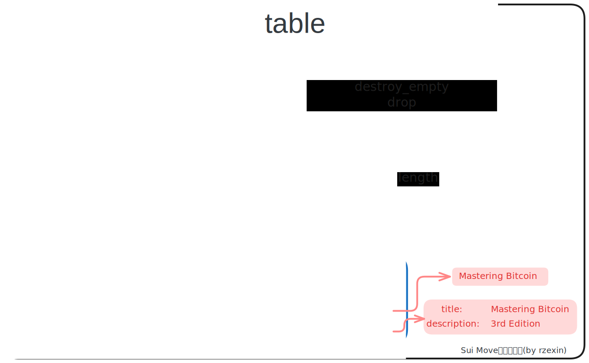

# table

## 模块说明

- `Table`是一种类似于`map`的集合
- 与传统集合不同的是，它的键和值不是存储在 `Table` 值中，而是使用`Sui`的对象系统（`sui::dynamic_field`）进行存储
- `Table` 结构仅作为一个句柄，用于在对象系统中检索这些键和值
- 具有完全相同的键值映射的 `Table` 值不会被 `==` 判断为相等
- `Table<K, V>` 是一个**同构映射**，意味着所有其键和值都具有相同的类型

## 源码路径

[table.move](https://github.com/MystenLabs/sui/blob/main/crates/sui-framework/packages/sui-framework/sources/table.move)

## 方法图解



## 结构定义

```move
public struct Table<phantom K: copy + drop + store, phantom V: store> has key, store {
    /// the ID of this table
    id: UID,
    /// the number of key-value pairs in the table
    size: u64,
}
```

## 方法说明

| 分类       | 方法                                                     | 说明                                                                                                    |
| ---------- | -------------------------------------------------------- | ------------------------------------------------------------------------------------------------------- |
| **初始化** | `new<...>(ctx: &mut TxContext): Table<K, V>`             | 创建空`Table`                                                                                           |
| **清理**   | `destroy_empty<...>(table: Table<K, V>)`                 | 销毁空`Table`，若不为空，将报错：`ETableNotEmpty`                                                       |
|            | `drop<...>(table: Table<K, V>)`                          | 删除一个可能非空的表格。只有在值具有`drop`能力时才可用                                                  |
| **增**     | `add<...>(table: &mut Table<K, V>, k: K, v: V)`          | 添加键值对到`Table`中<br />若`Key`已存在，将报错：`EFieldAlreadyExists`                                 |
| **删**     | `remove<...>(table: &mut Table<K, V>, k: K): V`          | 从`Table`中删除并返回指定`Key`的键值对，若`Key`不存在将报错：`EFieldDoesNotExist`                       |
| **改**     | `borrow_mut<...>(table: &mut Table<K, V>, k: K): &mut V` | 从`Table`中读取指定`Key`的值的可变引用，以便进行对值进行修改，若`Key`不存在将报错：`EFieldDoesNotExist` |
| **查**     | `borrow<...>(table: &Table<K, V>, k: K): &V`             | 从`Table`中读取指定`Key`的值，若`Key`不存在将报错：`EFieldDoesNotExist`                                 |
|            | `contains<...>(table: &Table<K, V>, k: K): bool`         | 若`Table`中包含指定的`Key`的值返回`true`，否则返回`false`                                               |
|            | `length<...>(table: &Table<K, V>): u64 `                 | 获取`Table`的长度                                                                                       |
|            | `is_empty<...>(table: &Table<K, V>): bool `              | 当且仅当`Table`为空时返回`true`，否则返回`false`                                                        |

## 代码示例

同样采用书架和书本的示例，书本对象将添加到书架的`Table`中。

### 结构定义

```move
public struct Bookshelf has key {
    id: UID,
    books: Table<String, Book>
}

public struct Book has key, store {
    id: UID,
    title: String,
    description: String,
}
```

### 创建书架共享对象

> 调用`table::new`方法

```move
public fun create_bookshelf(ctx: &mut TxContext) {
    transfer::share_object(Bookshelf {
        id: object::new(ctx),
        books: table::new<String, Book>(ctx),
    });
}
```

### 添加书本到书架

> 调用`table::add`方法

```move
public fun add_book(bookshelf: &mut Bookshelf, title: vector<u8>, description: vector<u8>, ctx: &mut TxContext) {
    let book = Book {
        id: object::new(ctx),
        title: ascii::string(title),
        description: ascii::string(description)
    };

    bookshelf.books.add(book.title, book);
}
```

### 获取书本

> 调用`table::borrow`方法。

```move
public fun get_book(bookshelf: &Bookshelf, title: vector<u8>): &Book {
    bookshelf.books.borrow(ascii::string(title))
}
```

### 设置书本的描述信息

> 调用`table::borrow_mut`方法。

```move
public fun set_book_desc(bookshelf: &mut Bookshelf, title: vector<u8>, description: vector<u8>) {
    let book_mut_ref = bookshelf.books.borrow_mut(ascii::string(title));
    book_mut_ref.description = ascii::string(description);
}
```

### 判断书本是否存在

> 调用`table::contains`方法。

```move
public fun is_book_existed(bookshelf: &Bookshelf, title: vector<u8>): bool {
    bookshelf.books.contains(ascii::string(title))
}
```

### 从书架上移除书本

> 调用`table::remove`方法。

```move
// 从书架上移除书本
public fun remove_book(bookshelf: &mut Bookshelf, title: vector<u8>): Book {
    bookshelf.books.remove(ascii::string(title))
}
```

### 判断书架是否为空

> 调用`table::is_empty`方法。

```move
public fun is_bookshelf_empty(bookshelf: &Bookshelf): bool {
    bookshelf.books.is_empty()
}
```

### 获取书本数量

> 调用`table::length`方法。

```move
public fun get_book_count(bookshelf: &Bookshelf): u64{
    bookshelf.books.length()
}
```

### 销毁空书架

> 调用`table::destroy_empty`方法。

```move
public fun destroy_empty_bookshelf(bookshelf: Bookshelf) {
    let Bookshelf {id, books} = bookshelf;
    books.destroy_empty();
    id.delete()
}
```

## 完整代码

- **table**

```move
{{#include ./codes/cookbook/sources/table.move}}
```

- **table_tests**

```move
{{#include ./codes/cookbook/tests/table_tests.move}}
```
