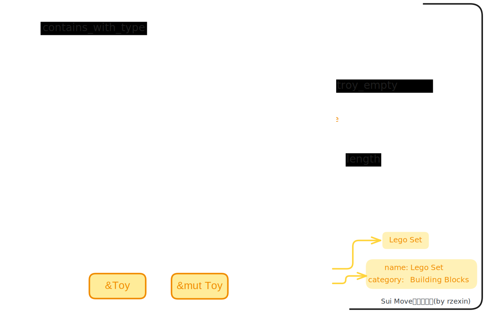

# bag

## 模块说明

- `Bag`同样是一种类似于`map`的集合
- 与`Table`的**同构映射**不同，`Bag`是**异构映射**集合，可以容纳任意类型的键值对
- 与`Table`类似，它的键和值不是存储在 `Bag` 值中，而是使用`Sui`的对象系统（`sui::dynamic_field`）进行存储
- `Bag` 结构仅作为一个句柄，用于在对象系统中检索这些键和值
- 具有完全相同的键值映射的 `Bag` 值不会被 `==` 判断为相等
- `Bag`必须为空才能被销毁

## 源码路径

[bag.move](https://github.com/MystenLabs/sui/blob/main/crates/sui-framework/packages/sui-framework/sources/bag.move)

## 方法图解



## 结构定义

> `Bag`类型没有任何类型参数，可以使用任意类型作为键值。

```move
public struct Bag has key, store {
    /// the ID of this bag
    id: UID,
    /// the number of key-value pairs in the bag
    size: u64,
}
```

## 方法说明

| 分类       | 方法                                                          | 说明                                                                                                                                                                      |
| ---------- | ------------------------------------------------------------- | ------------------------------------------------------------------------------------------------------------------------------------------------------------------------- |
| **初始化** | `new(ctx: &mut TxContext): Bag`                               | 创建空`Bag`                                                                                                                                                               |
| **清理**   | `destroy_empty<...>(bag: Bag)`                                | 销毁空`Bag`，若不为空，将报错：`ETableNotEmpty`                                                                                                                           |
| **增**     | `add<...>(bag: &mut Bag, k: K, v: V)`                         | 添加键值对到`Bag`中<br />若`Key`已存在，将报错：`EFieldAlreadyExists`                                                                                                     |
| **删**     | `remove<...>(bag: &mut Bag, k: K): V`                         | 从`Bag`中删除并返回指定`Key`的键值对<br />若`Key`不存在将报错：`EFieldDoesNotExist`<br />若值的类型与指定类型不匹配，将报错：`EFieldTypeMismatch`                         |
| **改**     | `borrow_mut<...>(bag: &Bag, k: K): &mut V`                    | 从`Bag`中读取指定`Key`的值的可变引用，以便进行对值进行修改<br />若`Key`不存在，将报错：`EFieldDoesNotExist`<br />若值的类型与指定类型不匹配，将报错：`EFieldTypeMismatch` |
| **查**     | `borrow<...>(bag: &Bag, k: K): &V`                            | 从`Bag`中读取指定`Key`的值<br />若`Key`不存在，将报错：`EFieldDoesNotExist`<br />若值的类型与指定类型不匹配，将报错：`EFieldTypeMismatch`                                 |
|            | `contains<K: ...>(bag: &Bag, k: K): bool`                     | 若`Bag`中包含指定的`Key`的值返回`true`，否则返回`false`                                                                                                                   |
|            | `contains_with_type<K: ..., V: store>(bag: &Bag, k: K): bool` | 若`Bag`中包含指定的`Key`的指定类型的值将返回`true`，否则返回`false`                                                                                                       |
|            | `length<...>(bag: &Bag): u64 `                                | 获取`Bag`的长度                                                                                                                                                           |
|            | `is_empty<...>(bag: &Bag): bool `                             | 当且仅当`Bag`为空时返回`true`，否则返回`false`                                                                                                                            |

## 代码示例

示例中定义了一个书架结构（`Bookshelf`），其中包含一个`Bag`类型的`items`，可以放入任意类型的键值对。示例中以在书架上放置书籍（`Book`）和玩具（`Toy`）两种不同的对象为例。

### 结构定义

```move
public struct Bookshelf has key {
    id: UID,
    items: Bag,
}

// 书籍
public struct Book has key, store {
    id: UID,
    title: String,
    description: String,
}

// 玩具
public struct Toy has key, store {
    id: UID,
    name: String,
    category: String,
}
```

### 创建书架共享对象

> 调用`bag::new`方法

```move
// 创建书架
public fun create_bookshelf(ctx: &mut TxContext) {
    transfer::share_object(Bookshelf {
        id: object::new(ctx),
        items: bag::new(ctx),
    });
}
```

### 放置书本到书架

> 调用`bag::add`方法

```move
public fun add_book(bookshelf: &mut Bookshelf, title: vector<u8>, description: vector<u8>, ctx: &mut TxContext) {
    let book = Book {
        id: object::new(ctx),
        title: ascii::string(title),
        description: ascii::string(description)
    };

    bookshelf.items.add(book.title, book);
}
```

### 放置玩具到书架

> 调用`bag::add`方法

```move
public fun add_toy(bookshelf: &mut Bookshelf, name: vector<u8>, category: vector<u8>, ctx: &mut TxContext) {
    let toy = Toy {
        id: object::new(ctx),
        name: ascii::string(name),
        category: ascii::string(category)
    };

    bookshelf.items.add(toy.name, toy);
}
```

### 获取书本

> 调用`bag::borrow`方法。

```move
public fun get_book(bookshelf: &Bookshelf, title: vector<u8>): &Book {
    bookshelf.items.borrow(ascii::string(title))
}
```

### 获取玩具

> 调用`bag::borrow`方法。

```move
public fun get_toy(bookshelf: &Bookshelf, name: vector<u8>): &Toy{
    bookshelf.items.borrow(ascii::string(name))
}
```

### 设置书本的描述信息

> 调用`bag::borrow_mut`方法。

```move
public fun set_book_desc(bookshelf: &mut Bookshelf, title: vector<u8>, description: vector<u8>) {
    let book_mut_ref = bookshelf.items.borrow_mut<_, Book>(ascii::string(title));
    book_mut_ref.description = ascii::string(description);
}
```

### 判断书本是否存在

> 调用`bag::contains`方法。

```move
public fun is_book_existed(bookshelf: &Bookshelf, title: vector<u8>): bool {
    bookshelf.items.contains(ascii::string(title))
}
```

### 从书架上移除书本

> 调用`bag::remove`方法。

```move
public fun remove_book(bookshelf: &mut Bookshelf, title: vector<u8>): Book {
    bookshelf.items.remove(ascii::string(title))
}
```

### 从书架上移除玩具

> 调用`bag::remove`方法。

```move
public fun remove_toy(bookshelf: &mut Bookshelf, name: vector<u8>): Toy{
    bookshelf.items.remove(ascii::string(name))
}
```

### 判断书架是否为空

> 调用`bag::is_empty`方法。

```move
public fun is_bookshelf_empty(bookshelf: &Bookshelf): bool {
    bookshelf.items.is_empty()
}
```

### 获取书架上物品数量

> 调用`bag::length`方法。

```move
public fun get_count(bookshelf: &Bookshelf): u64{
    bookshelf.items.length()
}
```

### 销毁空书架

> 调用`bag::destroy_empty`方法。

```move
public fun destroy_empty_bookshelf(bookshelf: Bookshelf) {
    let Bookshelf {id, items} = bookshelf;
    items.destroy_empty();
    id.delete()
}
```

## 完整代码

- **bag**

```move
{{#include ./codes/cookbook/sources/bag.move}}
```

- **bag_tests**

```move
{{#include ./codes/cookbook/tests/bag_tests.move}}
```
