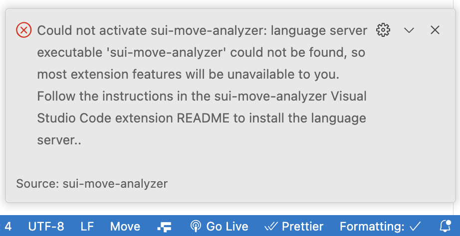
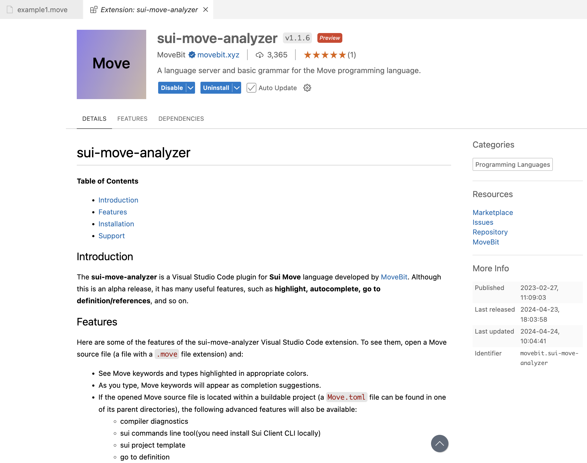
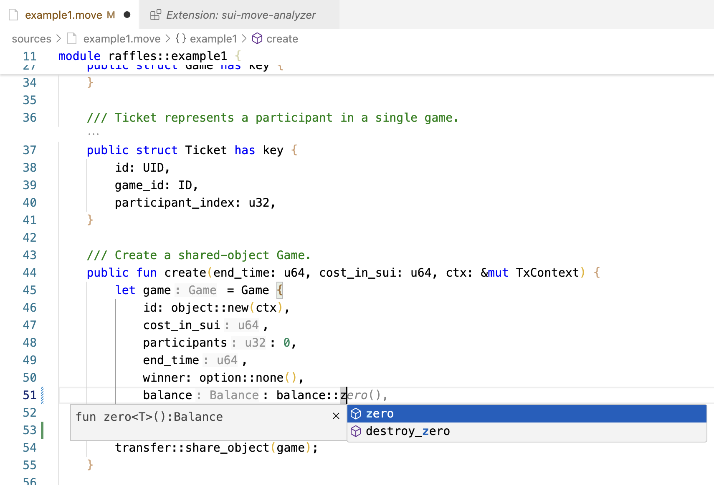

# VSCode插件

## 安装sui-move-analyzer language server

>   在安装VSCode插件前，需要先安装`sui-move-analyzer language server`，否则将报错：
>
>   

### 方式1：直接下载发行版本

-   下载最新版本

    >   下载地址：https://github.com/movebit/sui-move-analyzer/releases

-   改名为：`sui-move-analyzer` 或 `sui-move-analyzer.exe`
-   添加到**PATH**环境变量中
-   重启`VSCode`

### 方式2：使用cargo命令安装

-   执行安装命令

```bash
cargo install --git http://github.com/movebit/sui-move-analyzer --branch master sui-move-analyzer
```

-   添加到**PATH**环境变量中

```bash
export PATH=$HOME/.cargo/bin:$PATH
```

-   重启`VSCode`

## 安装VSCode插件

在VSCode插件市场搜索并安装：`sui-move-analyzer`。



## 效果展示

